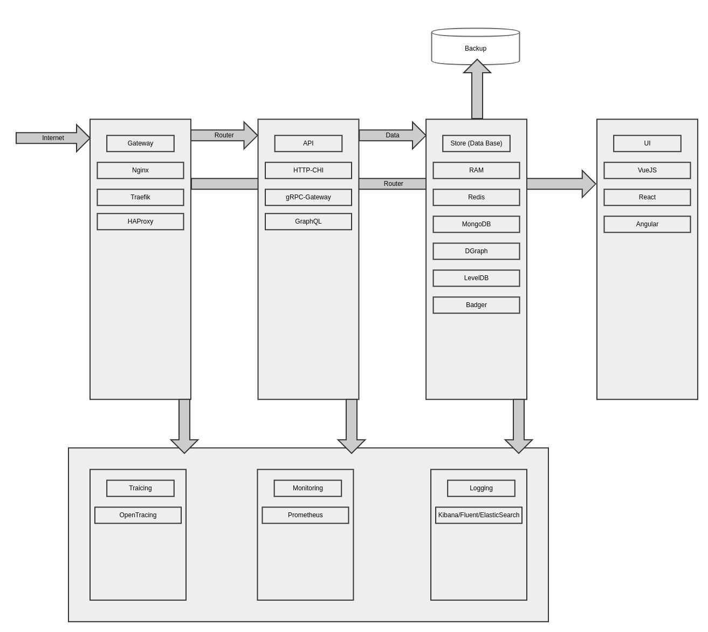

# shortlink

[](https://godoc.org/github.com/batazor/shortlink)
[](https://codecov.io/gh/batazor/shortlink)
[](https://travis-ci.org/batazor/shortlink)
[](https://goreportcard.com/report/github.com/batazor/shortlink)
[](https://github.com/batazor/shortlink/releases)
[](https://github.com/batazor/shortlink/blob/master/LICENSE)


Shortlink service

### High Level Architecture



##### Install dependencies

```
go get -u moul.io/protoc-gen-gotemplate
go get -u github.com/jteeuwen/go-bindata

make
```

### Run

```
docker-compose \
    -f docker-compose.yaml \
    -f ops/docker-compose/database/[DATABASE_NAME] \
    -f ops/docker-compose/gateway/[GATEWAY_NAME] \
    up -d 
```

##### As example

```
docker-compose \
    -f docker-compose.yaml \
    -f ops/docker-compose/database/postgres.yaml \
    -f ops/docker-compose/gateway/traefik.yaml \
    -f ops/docker-compose/tooling/opentracing.yaml \
    up -d 
```

### HTTP API

+ Import [Postman link](./docs/shortlink.postman_collection.json) for test HTTP API

###### Support HTTP REST API:

- HTTP (chi)
- gRPC-gateway
- GraphQL

### Store provider

+ RAM
+ Redis
+ MongoDB
+ Postgres
+ DGraph
+ LevelDB
+ Badger
+ SQLite

### Cloud-Native

+ Prometheus
+ HealthCheck
+ Support K8S (Helm Chart)
