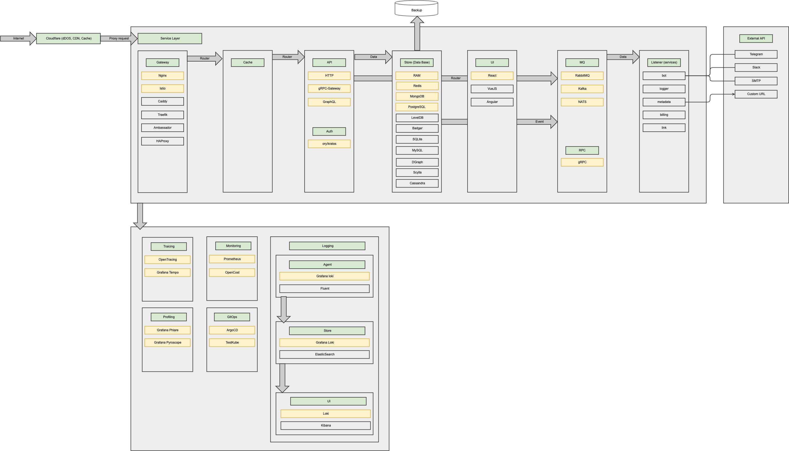

# shortlink 

ShortLink is an open-source educational project that provides a pretty user interface and respects GDPR. 

The goal of the project is to demonstrate the practical application of microservices architecture.

  
  

### High Level Architecture 🚀

The project covers the entire process - from identifying Bounded Contexts to implementing microservices using
cutting-edge technologies and best practices.  

_Please [star ⭐](https://github.com/shortlink-org/shortlink/stargazers) the repo if you want us to continue developing and improving ShortLink! 😀_

### Boundaries

> [!TIP]
> 
> Our project follows Domain-Driven Design (DDD) principles, organizing code into distinct domains for clarity and easier updates.

| Bounded Context       | Description              | Type subdomain | Docs                                        |
|-----------------------|--------------------------|----------------|---------------------------------------------|
| API Gateway           | Gateway for all services | Supporting     | [docs](./boundaries/api/README.md)          |
| Auth Boundary         | Auth services            | Generic        | [docs](./boundaries/auth/README.md)         |
| Billing Boundary      | Payment services         | Generic        | [docs](./boundaries/billing/README.md)      |
| Chat Boundary         | Chat services            | Supporting     | [docs](./boundaries/chat/README.md)         |
| Delivery Boundary     | Delivery services        | Supporting     | [docs](./boundaries/delivery/README.md)     |
| DS Boundary           | Data Science services    | Supporting     | [docs](./boundaries/ds/README.md)           |
| Link Boundary         | Link services            | Core           | [docs](./boundaries/link/README.md)         |
| Marketing Boundary    | Marketing services       | Supporting     | [docs](./boundaries/marketing/README.md)    |
| Notification Boundary | Notification services    | Generic        | [docs](./boundaries/notification/README.md) |
| Platform Boundary     | Platform services        | Supporting     | [docs](./boundaries/platform/README.md)     |
| Search Boundary       | Search services          | Supporting     | [docs](./boundaries/search/README.md)       |
| Shop Boundary         | Shop services            | Supporting     | [docs](./boundaries/shop/README.md)         |
| ShortDB Boundary      | ShortDB services         | Supporting     | [docs](./boundaries/shortdb/README.md)      |
| UI Boundary           | UI services              | Supporting     | [docs](./boundaries/ui-monorepo/README.md)  |

> #### Contributing
>
> - [Getting Started](./CONTRIBUTING.md#getting-started)

### Architecture decision records (ADR)

> [!IMPORTANT]
> An architecture decision record (ADR) is a document that captures an important architecture decision 
made along with its context and consequences.
>
>+ [Docs ADR](https://github.com/joelparkerhenderson/architecture-decision-record)
>
> **Decisions:**
>  + [main decisions](./docs/ADR/README.md)
>  + [ops decisions](./ops/docs/ADR/README.md)
>
> Also, each boundary context and service has its own ADR. You can find them in the relevant sections.

### License

> [!WARNING]
> 
> This project includes dependencies licensed under the GNU Lesser General Public License (LGPL). 
> Users must comply with LGPL terms when using or modifying these dependencies. 
> For detailed information on each LGPL library used in this project, please refer to the respective license documentation 
> included with each library. For comprehensive license compliance information, including dependencies and their licenses, 
> you can read more details in our FOSSA report.

[mergify]: https://mergify.io

[mergify-status]: https://img.shields.io/endpoint.svg?url=https://dashboard.mergify.io/badges/shortlink-org/shortlink&style=flat
