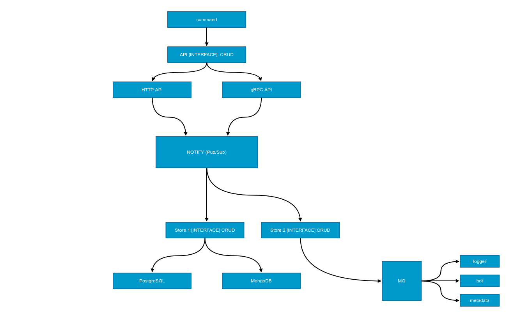
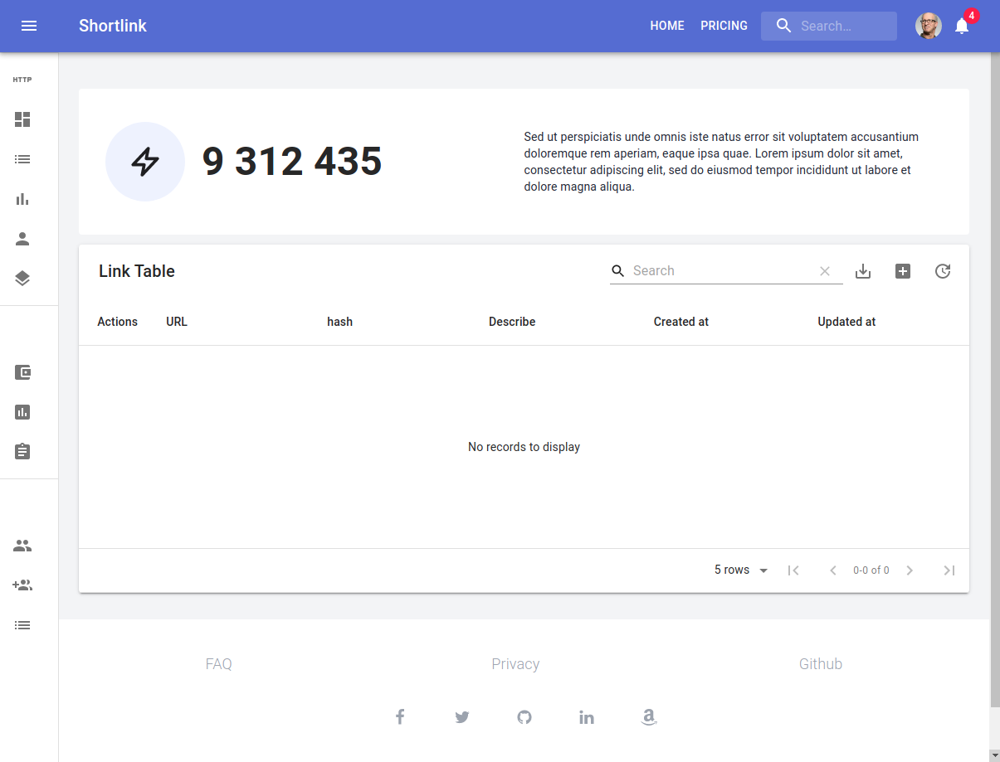
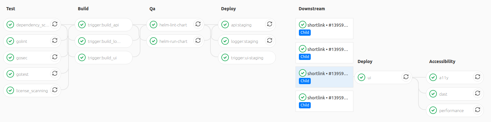

# shortlink

[](https://godoc.org/github.com/batazor/shortlink)
[](https://codecov.io/gh/batazor/shortlink)
[](https://goreportcard.com/report/github.com/batazor/shortlink)
[](https://github.com/batazor/shortlink/releases)
[](https://github.com/batazor/shortlink/blob/master/LICENSE)


[](https://bestpractices.coreinfrastructure.org/projects/3510)
[![Mergify Status][mergify-status]][mergify]

Shortlink service

### High Level Architecture


##### Requirements

- docker
- docker-compose
- protoc 3.7.1+

##### Services

| Service     | Description                          | Language/Framework | Docs                       |
|-------------|--------------------------------------|--------------------|----------------------------|
| shortlink   | Shortlink service                    | Go                 |                            |
| logger      | Logger service                       | Go                 |                            |
| bot         | Send notify to smtp, slack, telegram | Go                 |                            |
| shortctl    | Shortlink CLI                        | Go                 | [docs](./docs/shortctl.md) |

### Run

```
make run
```

##### DNS/HTTP

+ `ui-nuxt.local`
+ `shortlink.local`

Add `127.0.0.1 *.local` to your `/etc/hosts`

### HTTP API



+ Import [Postman link](./docs/shortlink.postman_collection.json) for
  test HTTP API
+ Swagger [docs](https://shortlink1.gitlab.io/shortlink)

###### Support HTTP REST API:

- HTTP (chi)
- gRPC-gateway
- GraphQL
- ***Optional***
    - go-kit
    - [CloudEvents](https://cloudevents.io/)

### MQ

+ [Kafka](https://kafka.apache.org/)
+ NATS
+ RabbitMQ

### Store provider

+ RAM
+ Redis
+ MongoDB
+ MySQL
+ Postgres
+ LevelDB
+ Badger
+ SQLite
+ Scylla
+ Сassandra (via: Scylla driver)
+ ***Optional***
    + RethinkDB
    + DGraph

### Cloud-Native

+ Prometheus
  + prometheus-operator
    + notify: slack, email, telegram
+ HealthCheck
+ Support K8S
  + Helm Chart
    + [pingcap/chaos-meshh](https://github.com/pingcap/chaos-mesh)
  + Minikube
  + Backup/Restore ([Velero](https://velero.io/)
+ Istio
+ MetalLB

### Gateway

+ Traefik
+ Nginx

### UI service

+ Nuxt: [demo UI](http://shortlink.surge.sh/)
+ Next

| Service     | Description                       | Language/Framework |
|-------------|-----------------------------------|--------------------|
| next        | UI service                        | JS/ReactJS         |
| nuxt        | UI service                        | JS/VueJS           |

##### ENV for UI

Use `.env` file in `pkg/ui/[nuxt/next/etc]` directories for setting your UI


| Name                | Default                                                     | Description                                                                                    |
|:--------------------|:------------------------------------------------------------|:-----------------------------------------------------------------------------------------------|
| NODE_ENV            | -                                                           | Select: production, development, etc...                                                        |
| SENTRY_DSN          | -                                                           | Your sentry DSN                                                                                |
| API_URL_HTTP        | http://localhost:7070                                       | HTTP API Endpoint                                                                              |

#### UI Screenshot

| Describe                | Screenshot                           |
|-------------------------|--------------------------------------|
| Link Table              |  |

### Configuration

<details><summary>DETAILS</summary>
<p>

##### [12 factors: ENV](https://12factor.net/config)

[View ENV Variables](./docs/env.md)

</p>
</details>

### CoreDNS IP table

| Service | Ip address | Description                                    |
|:--------|:-----------|:-----------------------------------------------|
| store   | 10.5.0.100 | Main database (postgres/mongo/cassandra/redis) |

##### troubleshooting

Sometimes a container without a specified ip may occupy a binding
address of another service, which will result in `Address already in
use`.

### Ansible

<details><summary>DETAILS</summary>
<p>

##### Vagrant

```
cd ops/vagrant
vagrant up

cd ops/ansible
ansible-playbook playbooks/playbook.yml
```

##### DNS/HTTP

+ `ui-nuxt.shortlink.vagrant:8081`

</p>
</details>

### Kubernetes

<details><summary>DETAILS</summary>
<p>

##### HELM

+ **common** - run common tools (ingress)
+ **shortlink-\*** - run shortlink applications (api, logger, ui)
+ **chaos** - run chaos daemon
+ **ingress** - run ingress ;-)

##### DNS

+ `ui-nuxt.shortlink.minikube`
+ `api.shortlink.minikube`
+ `grafana.minikube`
+ `jaeger.minikube`
+ `prometheus.minikube`

</p>
</details>

### GITLAB CI



##### GitLab Variable

- SURGE_LOGIN
- SURGE_TOKEN
- DANGER_GITLAB_API_TOKEN - `API TOKEN` for danger

##### Support environment

- Minikube
- [Yandex Cloud](https://cloud.yandex.ru/)
- [AWS EKS](https://aws.amazon.com/eks/)

### [Error code](./internal/error/status/exit.go)

| CODE | Describe     |
|------|--------------|
| 0    | SUCCESS      |
| 1    | ERROR_CONFIG |

## -~- THE END -~-

[mergify]: https://mergify.io
[mergify-status]: https://img.shields.io/endpoint.svg?url=https://dashboard.mergify.io/badges/batazor/shortlink&style=flat
