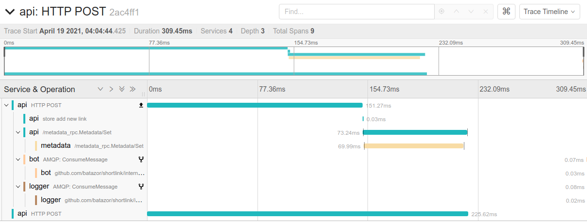

<div align="center">

# shortlink

Shortlink service 

[](https://pkg.go.dev/mod/github.com/batazor/shortlink)
[](https://codecov.io/gh/batazor/shortlink)
[](https://goreportcard.com/report/github.com/batazor/shortlink)
[](https://github.com/batazor/shortlink/releases)
[](https://github.com/batazor/shortlink/blob/main/LICENSE)
[](https://bestpractices.coreinfrastructure.org/projects/3510)

</div>

<hr />

### High Level Architecture 🚀


### Architecture (miro.com)

- [Low-level schema](https://miro.com/app/board/o9J_laImQpo=/)
- [Auth](https://miro.com/app/board/o9J_lA5Wmhg=/)
- [Event Sourcing](https://miro.com/app/board/o9J_l-6o1U0=/)
- [C4](./docs/c4)

### Architecture decision records] (ADR)

An architecture decision record (ADR) is a document that captures an important architecture decision 
made along with its context and consequences.

+ [Docs](https://github.com/joelparkerhenderson/architecture-decision-record)

##### Services

| Service     | Description                                 | Language/Framework        | Docs                                     |
|-------------|---------------------------------------------|---------------------------|------------------------------------------|
| landing     | Welcome page                                | JS/JQuery                 |                                          |
| docs        | Example blog                                | [Hugo](https://gohugo.io) | https://batazor.github.io/shortlink/     |
| next        | UI service                                  | JS/NextJS                 | [docs](./ui/next/README.md)              |
| api         | GateWay                                     | Go                        | [docs](./docs/services/README.md)        |
| link        | Link service                                | Go                        | [docs](./docs/services/README.md)        |
| newsletter  | Newsletter service                          | Rust                      |                                          |
| proxy       | Proxy service for redirect to original URL  | TypeScript                |                                          |
| bot         | Telegram bot                                | JAVA                      |                                          |
| billing     | Billing service                             | Go                        |                                          |
| logger      | Logger service                              | Go                        |                                          |
| metadata    | Parser site by API                          | Go                        |                                          |
| notify      | Send notify to smtp, slack, telegram        | Go                        |                                          |
| shortctl    | Shortlink CLI                               | Go                        | [docs](./docs/shortctl.md)               |
| csi         | CSI example                                 | Go                        |                                          |
| ory/kratos  | User management service                     | Go                        | [docs](https://www.ory.sh/kratos/docs/)  |
| ory/hydra   | OAuth 2.0 Provider                          | Go                        | [docs](https://www.ory.sh/keto/docs/)    |
| shortdb | Custom database | Go | [docs](./internal/pkg/shortdb/README.md) |

### Run

<details><summary>DETAILS</summary>
<p>

##### Require

###### Install GIT sub-repository

```
git submodule update --init --recursive
```

##### docker-compose

###### For run
```
make run
```

###### For down
```
make down
```


##### Kubernetes (1.19+)

###### For run
```
make minikube-up
make helm-shortlink-up
```

###### For down
```
make minikube-down
```

##### Skaffold [(link)](https://skaffold.dev/)

###### For run
```
make skaffold-init
make skaffold-up
```

###### For down
```
make skaffold-down
```

###### Debug mode
```
make skaffold-debug
```

</p>
</details>

### HTTP API


+ Import [Postman link](./docs/shortlink.postman_collection.json) for
  test HTTP API
+ Swagger [docs](https://shortlink-org.gitlab.io/shortlink)

###### Support HTTP REST API:

- HTTP (chi)
- gRPC-gateway
- GraphQL
- ***Optional***
    - go-kit
    - [CloudEvents](https://cloudevents.io/)

### MQ

+ [Kafka](https://kafka.apache.org/)
+ [NATS](https://nats.io/)
+ [RabbitMQ](https://www.rabbitmq.com/)

### OpenTracing



### Cloud-Native

+ Development
  + [Skaffold](https://skaffold.dev/)
  + Telepresence
+ Logger
  + [Loki](./docs/logger.md)
  + DataDog
+ Prometheus
  + prometheus-operator
    + notify: slack, email, telegram
+ HealthCheck
+ Support K8S
  + Helm Chart
    + [pingcap/chaos-meshh](https://github.com/pingcap/chaos-mesh)
  + Minikube
  + Backup/Restore [(Velero)](https://velero.io/)
  + Custom CSI driver (fork [csi-driver-host-pat](https://github.com/kubernetes-csi/csi-driver-host-path))
+ Istio
+ MetalLB
+ [kyverno](https://kyverno.io/) - Kubernetes Native Policy Management
+ DataBase
  + [postgres-operator (zalando)](https://github.com/zalando/postgres-operator)

### Gateway

+ Traefik
+ Nginx

### UI

##### ENV for UI

Use `.env` file in `ui/[next/etc]` directories for setting your UI


| Name                | Default                                                     | Description                                                                                    |
|:--------------------|:------------------------------------------------------------|:-----------------------------------------------------------------------------------------------|
| NODE_ENV            | -                                                           | Select: production, development, etc...                                                        |
| SENTRY_DSN          | -                                                           | Your sentry DSN                                                                                |

#### UI Screenshot

<details>

| Describe                | Screenshot                           |
|-------------------------|--------------------------------------|
| Link Table              |  |

</details>

### Mobile

+ `Hello World` on flutter ;-)

### Configuration

<details><summary>DETAILS</summary>
<p>

##### [12 factors: ENV](https://12factor.net/config)

[View ENV Variables](./docs/env.md)

</p>
</details>

### CoreDNS IP table

| Service | Ip address | Description                                    |
|:--------|:-----------|:-----------------------------------------------|
| store   | 10.5.0.100 | Main database (postgres/mongo/cassandra/redis) |

##### troubleshooting

Sometimes a container without a specified ip may occupy a binding
address of another service, which will result in `Address already in
use`.

### Ansible

<details><summary>DETAILS</summary>
<p>

##### Vagrant

```
cd ops/vagrant
vagrant up

cd ops/ansible
ansible-playbook playbooks/playbook.yml
```

##### DNS/HTTP

+ `ui-next.shortlink.vagrant:8081`

</p>
</details>

### CI/CD

- [GitLab CI](./ops/gitlab/README.md)
- [GitHub CI](./.github/DOCS.md)

## -~- THE END -~-

[mergify]: https://mergify.io
[mergify-status]: https://img.shields.io/endpoint.svg?url=https://dashboard.mergify.io/badges/batazor/shortlink&style=flat
