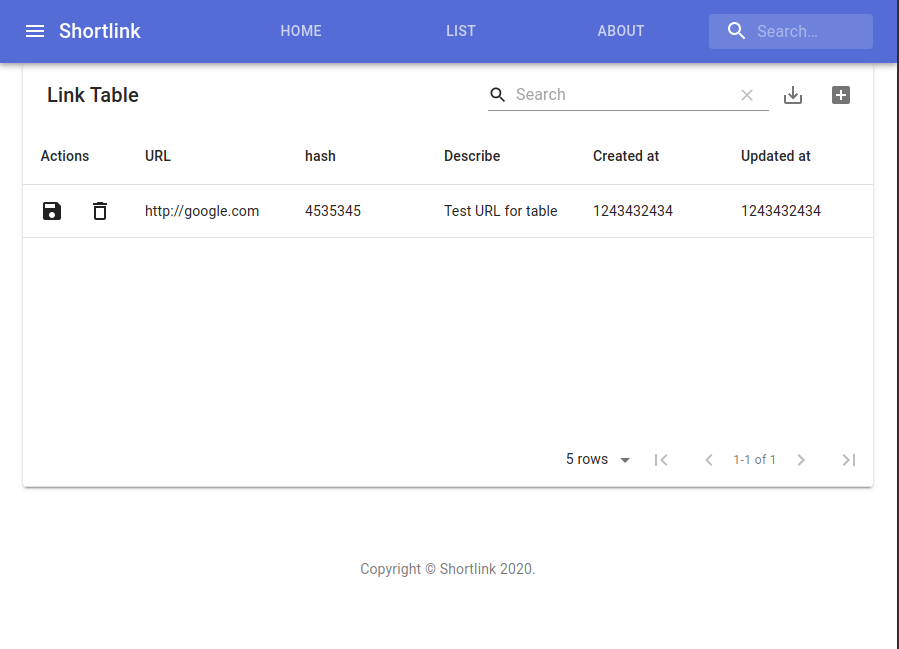

<div align="center">

# shortlink

Shortlink is an open-source project that provides a pretty user interface and respects GDPR.   
We use edge technologies and have many years of experience.  

We're constantly researching the best solutions on the market so that we can benefit  
our community and solve a problem for millions of people.

[](https://pkg.go.dev/mod/github.com/batazor/shortlink)
[](https://codecov.io/gh/batazor/shortlink)
[](https://goreportcard.com/report/github.com/batazor/shortlink)
[](https://github.com/batazor/shortlink/releases)
[](https://github.com/batazor/shortlink/blob/main/LICENSE)
[](https://bestpractices.coreinfrastructure.org/projects/3510)

</div>

<hr />

### High Level Architecture 🚀


### Architecture (miro.com)

- [Low-level schema](https://miro.com/app/board/o9J_laImQpo=/)
- [Auth](https://miro.com/app/board/o9J_lA5Wmhg=/)
- [Event Sourcing](https://miro.com/app/board/o9J_l-6o1U0=/)
- [C4](./docs/c4)

### Architecture decision records] (ADR)

An architecture decision record (ADR) is a document that captures an important architecture decision 
made along with its context and consequences.

+ [Docs](https://github.com/joelparkerhenderson/architecture-decision-record)

##### Services

| Service          | Description                                                              | Language/Framework        | Docs                                         |
|------------------|--------------------------------------------------------------------------|---------------------------|----------------------------------------------|
| landing          | Welcome page                                                             | JS/JQuery                 |                                              |
| docs             | Example blog                                                             | [Hugo](https://gohugo.io) | [docs](https://batazor.github.io/shortlink/) |
| next             | UI service                                                               | JS/NextJS                 | [docs](./ui/next/README.md)                  |
| api              | GateWay                                                                  | Go                        | [docs](./docs/services/README.md)            |
| link             | Link service                                                             | Go                        | [docs](./docs/services/README.md)            |
| newsletter       | Newsletter service                                                       | Rust                      |                                              |
| proxy            | Proxy service for redirect to original URL                               | TypeScript                |                                              |
| bot              | Telegram bot                                                             | JAVA                      |                                              |
| billing          | Billing service                                                          | Go                        |                                              |
| wallet           | Wallet service                                                           | Go (Solidity)             | [docs](./internal/services/wallet/README.md) |
| ws               | Webscoket service                                                        | Go                        | [docs](./internal/services/ws/README.md)     |
| logger           | Logger service                                                           | Go                        |                                              |
| metadata         | Parser site by API                                                       | Go                        |                                              |
| notify           | Send notify to smtp, slack, telegram                                     | Go                        |                                              |
| shortctl         | Shortlink CLI                                                            | Go                        | [docs](./docs/shortctl.md)                   |
| csi              | CSI example                                                              | Go                        |                                              |
| ory/kratos       | User management service                                                  | Go                        | [docs](https://www.ory.sh/kratos/docs/)      |
| ory/hydra        | OAuth 2.0 Provider                                                       | Go                        | [docs](https://www.ory.sh/keto/docs/)        |
| shortdb          | Custom database                                                          | Go                        | [docs](./pkg/shortdb/README.md)              |
| shortdb-operator | Kubernetes Operator for [shortdb]((./pkg/shortdb/README.md)) database    | Go                        | [docs](./pkg/shortdb-operator/README.md)     |
| stats            | Shortlink stats server                                                   | CPP                       | [docs](./internal/services/stats/README.md)  |
| chat             | Chat service                                                             | Elixir (Phoenix)          | [docs](./internal/services/chat/README.md)   |

### Techradar

[shortlink-techradar](https://radar.thoughtworks.com/?sheetId=https://raw.githubusercontent.com/batazor/shortlink/main/docs/thoughtworks.radar.csv)

### Run

<details><summary>DETAILS</summary>
<p>

##### Require

###### Install GIT sub-repository

```
git submodule update --init --recursive
```

##### docker compose

###### For run
```
make run
```

###### For down
```
make down
```


##### Kubernetes (1.19+)

###### For run
```
make minikube-up
make helm-shortlink-up
```

###### For down
```
make minikube-down
```

##### Skaffold [(link)](https://skaffold.dev/)

###### For run
```
make skaffold-init
make skaffold-up
```

###### For down
```
make skaffold-down
```

###### Debug mode
```
make skaffold-debug
```

</p>
</details>

### HTTP API


+ Import [Postman link](./docs/shortlink.postman_collection.json) for
  test HTTP API
+ Swagger [docs](https://shortlink-org.gitlab.io/shortlink)

###### Support HTTP REST API:

- HTTP (chi)
- gRPC-gateway
- GraphQL
- ***Optional***
    - [CloudEvents](https://cloudevents.io/)

### MQ

+ [Kafka](https://kafka.apache.org/)
+ [NATS](https://nats.io/)
+ [RabbitMQ](https://www.rabbitmq.com/)

### OpenTracing


### Cloud-Native

+ Development
  + [Skaffold](https://skaffold.dev/)
  + Telepresence
+ HealthCheck
+ Support K8S
  + Helm Chart
    + [pingcap/chaos-meshh](https://github.com/pingcap/chaos-mesh)
  + Minikube
  + Backup/Restore [(Velero)](https://velero.io/)
  + Custom CSI driver (fork [csi-driver-host-pat](https://github.com/kubernetes-csi/csi-driver-host-path))
+ Ingress (Gateway)
  + Istio
  + Nginx
  + Traefik
+ MetalLB
+ [kyverno](https://kyverno.io/) - Kubernetes Native Policy Management
+ Storage
  + [rook-ceph](https://rook.io/)
    + ceph cluster (3 node)
    + grafana dashboard
    + prometheus metrics
+ Observability
  + [Jaeger](https://www.jaegertracing.io/) - Distributed tracing
  + **Prometheus** - Monitoring
    + [Prometheus](https://prometheus.io/)
    + prometheus-operator
      + notify: slack, email, telegram
  + **Grafana stack (LGTM)**
    * [Grafana](https://github.com/grafana/grafana), the open and composable observability and data visualization platform.
    * [Loki](https://github.com/grafana/loki), like Prometheus, but for logs.
      + [docs](./docs/logger.md)
    * [Grafana](https://github.com/grafana/grafana), the open and composable observability and data visualization platform.
    + [OnCall](https://grafana.com/oss/oncall/) - On-call scheduling
    + [Phlare](https://grafana.com/oss/phlare/) - Profiling

### UI

##### ENV for UI

Use `.env` file in `ui/[next/etc]` directories for setting your UI


| Name                | Default                                                     | Description                                                                                    |
|:--------------------|:------------------------------------------------------------|:-----------------------------------------------------------------------------------------------|
| NODE_ENV            | -                                                           | Select: production, development, etc...                                                        |
| SENTRY_DSN          | -                                                           | Your sentry DSN                                                                                |

#### UI Screenshot

<details>

| Describe                | Screenshot                           |
|-------------------------|--------------------------------------|
| Link Table              |  |

</details>

### Mobile

+ `Hello World` on flutter ;-)

### Configuration

<details><summary>DETAILS</summary>
<p>

##### [12 factors: ENV](https://12factor.net/config)

[View ENV Variables](./docs/env.md)

</p>
</details>

### CoreDNS IP table

| Service | Ip address | Description                                    |
|:--------|:-----------|:-----------------------------------------------|
| store   | 10.5.0.100 | Main database (postgres/mongo/cassandra/redis) |

##### troubleshooting

Sometimes a container without a specified ip may occupy a binding
address of another service, which will result in `Address already in
use`.

### Ansible

<details><summary>DETAILS</summary>
<p>

##### Vagrant

```
cd ops/vagrant
vagrant up

cd ops/ansible
ansible-playbook playbooks/playbook.yml
```

##### DNS/HTTP

+ `ui-next.shortlink.vagrant:8081`

</p>
</details>

### CI/CD

- [GitLab CI](./ops/gitlab/README.md)
- [GitHub CI](./.github/DOCS.md)
- ArgoCD

## -~- THE END -~-

[mergify]: https://mergify.io
[mergify-status]: https://img.shields.io/endpoint.svg?url=https://dashboard.mergify.io/badges/batazor/shortlink&style=flat
