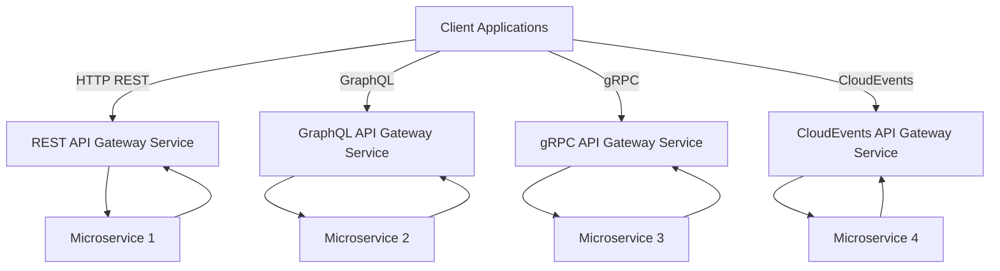

# 2. Split API Gateway Service into Separate Services for Each Protocol

Date: 2023-06-17

## Status

Accepted

## Context

As the number of client applications and microservices in our system continues to grow, the current design of 
the API Gateway Service (handling all protocols in one service) has begun to show signs of strain. 

This single service needs to manage the intricacies of four distinct protocols, making it a complex and large codebase, 
which is harder to maintain and develop further. Each protocol also has different performance characteristics 
and resource needs, making it difficult to optimize the service for all scenarios.

## Decision

To tackle these issues, we propose to split the current monolithic API Gateway Service into four separate services - one 
for each supported protocol. This will result in the creation of separate API Gateway Services for HTTP REST, GraphQL, 
gRPC, and CloudEvents.

By segregating services by protocol, we can optimize each service for its specific protocol's performance characteristics, 
maintainability, and feature set. Each service would become smaller, simpler, and easier to maintain and develop further.

This decision is visualized with the following architecture diagram:

## Consequences

By splitting the API Gateway Service, we introduce the benefits of simpler, more maintainable services which can be 
optimized individually. It also allows teams to develop and deploy updates for each service independently, 
improving development velocity.

However, this also means more services to manage and maintain, and there could be an increase in the operational overhead.
It could potentially introduce complexity on the client side, as they will need to interact with multiple 
gateway services based on the protocol used.

To mitigate this, we would need robust service discovery and good client library support. Comprehensive documentation 
will be crucial to guide the clients about which service to use based on their protocol preference.

Finally, intercommunication between the gateways will need to be addressed, especially for scenarios where one request 
might need to utilize multiple protocols. We should consider whether synchronous or asynchronous communication 
is the most appropriate for such scenarios, and whether we need to introduce a new service to coordinate this.

This proposal needs further investigation and experimentation to validate the trade-offs. It should only be accepted 
after conducting a successful pilot project.
