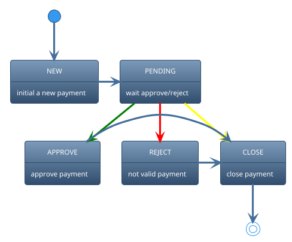

## Payment domain

```plantuml
@startuml
!theme spacelab

NEW : initial a new payment
PENDING: wait approve/reject
APPROVE: approve payment
REJECT: not valid payment
CLOSE: close payment

[*] --> NEW

NEW -> PENDING

PENDING --[#green]> APPROVE
PENDING --[#red]> REJECT
PENDING --[#yellow]> CLOSE

APPROVE -> CLOSE
REJECT -> CLOSE

CLOSE --> [*]

@enduml
```
