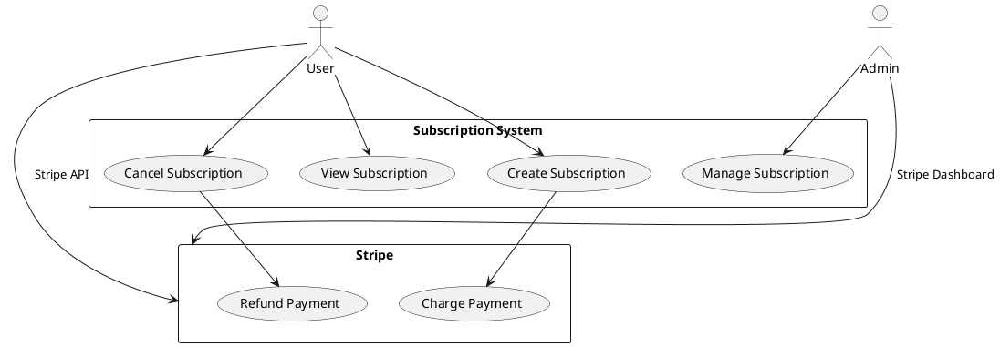

## UC-5: Works with a subscription

```plantuml
@startuml
actor User
actor Admin

rectangle "Subscription System" {
  User --> (Create Subscription)
  User --> (Cancel Subscription)
  User --> (View Subscription)
  Admin --> (Manage Subscription)
}

rectangle "Stripe" {
  (Create Subscription) --> (Charge Payment)
  (Cancel Subscription) --> (Refund Payment)
}

User --> Stripe : "Stripe API"
Admin --> Stripe : "Stripe Dashboard"

@enduml
```
