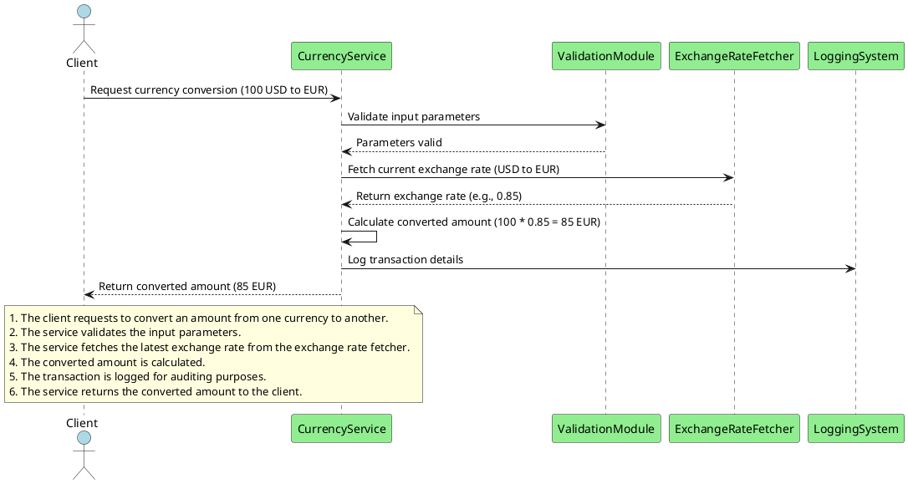

# Use Case: Currency Conversion Between Different Currencies

> **Note:**
> This use case is based on the system's core functionality for converting amounts between different currencies using up-to-date exchange rates.

## Overview

This use case describes how the **Currency Service** handles the conversion of monetary amounts from one currency to another. The service utilizes the latest exchange rates to provide accurate conversions, ensuring that users can perform financial transactions or obtain price information in their desired currency.

## Flow

1. **Client Requests Currency Conversion**:

    - The **Client** sends a request to the **Currency Service** to convert an amount from a base currency to a target currency (e.g., convert 100 USD to EUR).

2. **Validate Input Parameters**:

    - The **Currency Service** validates the request parameters to ensure that:
        - The base and target currency codes are valid ISO 4217 currency codes.
        - The amount to be converted is a positive number.

3. **Fetch Current Exchange Rate**:

    - The **Currency Service** invokes the **Exchange Rate Fetcher Use Case** to retrieve the latest exchange rate for the specified currency pair.
    - The exchange rate is obtained using the **Weighted Average Approach** as described in [ADR-0005](../../docs/ADR/decisions/0005-handling-divergence-in-exchange-rates-between-providers.md).

4. **Calculate Converted Amount**:

    - The service calculates the converted amount using the formula:

      ```
      converted_amount = amount * exchange_rate
      ```

5. **Return the Converted Amount**:

    - The service returns the converted amount to the client, along with details such as the exchange rate used and timestamp.

## Components Involved

- **Currency Service**: Core service responsible for handling currency conversion requests and returning accurate results.
- **Exchange Rate Fetcher Use Case**: Use case responsible for fetching the latest exchange rates, possibly aggregating data from multiple sources.
- **Client**: The requester of the currency conversion, which could be an end-user application or another service.
- **Validation Module**: Ensures that input parameters are correct and valid.
- **Logging and Audit System**: Records transactions for auditing and tracking purposes.

## Sequence Diagram



## Error Handling

### 1. Invalid Input Parameters

- **Scenario**: The client provides invalid currency codes or a negative amount.
- **Handling**:
    - The service returns an error response (`400 Bad Request`) indicating the invalid parameters.
    - Error details specify whether the issue is with the currency codes or the amount.
    - The request is not processed further.

### 2. Exchange Rate Not Found

- **Scenario**: The exchange rate for the specified currency pair is unavailable.
- **Handling**:
    - The service returns an error response (`404 Not Found`) indicating that the exchange rate is not available.
    - The error is logged for further analysis.
    - The client is advised to try again later or verify the currency codes.

### 3. Exchange Rate Fetcher Unavailable

- **Scenario**: The exchange rate fetcher use case is down or unreachable.
- **Handling**:
    - The service returns an error response (`503 Service Unavailable`) indicating a temporary issue.
    - The error is logged, and an alert may be sent to the system administrator.
    - The client is advised to retry the request after some time.

### 4. Internal Server Error

- **Scenario**: An unexpected error occurs within the currency service.
- **Handling**:
    - The service returns an error response (`500 Internal Server Error`).
    - Detailed error information is logged internally.
    - The client receives a generic error message to avoid exposing internal details.
