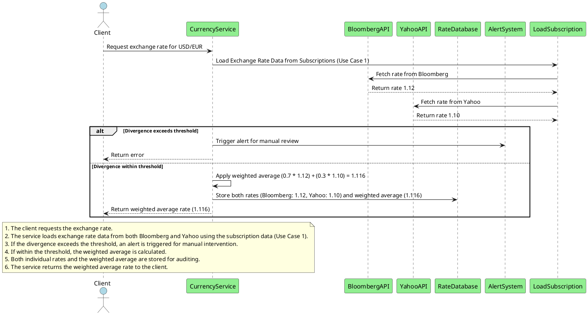

# Use Case: Handle Exchange Rate Discrepancies Using Weighted Average Approach

> [!NOTE]
> This use case is based on the architectural decision described in [ADR-0005](../../docs/ADR/decisions/0005-handling-divergence-in-exchange-rates-between-providers.md).

## Overview

This use case describes how the **Currency Service** handles discrepancies between exchange rates provided 
by **Bloomberg** and **Yahoo**. Following ADR-0005, we employ a **Weighted Average Approach** to calculate 
a reliable exchange rate and store both rates for audit purposes. If the divergence between rates exceeds 
a configurable threshold, an alert is triggered for manual intervention, and until resolved, 
the service returns an error.

## Flow

1. **Client Requests Exchange Rate**:

  - The **Client** sends a request to the **Currency Service** to fetch the exchange rate for a specific currency pair (e.g., USD/EUR).

2. **Load Exchange Rate Data from Subscriptions (Use Case 1)**:

  - The **Currency Service** invokes **Use Case 1 - Load Exchange Rate Data from Subscriptions**, which retrieves the rates from both **Bloomberg** and **Yahoo**.
  - **Use Case 1** initiates concurrent requests to both providers:
    - Fetch rate from **Bloomberg** (e.g., 1.12).
    - Fetch rate from **Yahoo** (e.g., 1.10).

3. **Check for Rate Divergence**:

  - After receiving the rates from both providers, the **Currency Service** checks if the difference between the two rates exceeds the pre-configured threshold.
  - If the difference exceeds the threshold:
    - An alert is triggered, and the **Alert System** is notified for manual intervention.
    - The system returns an error to the client until the discrepancy is resolved manually.
  - If the divergence is within the acceptable threshold, proceed to the next step.

4. **Apply Weighted Average**:

  - The system calculates the **weighted average** of the two rates, using the weights defined in the configuration (e.g., 0.7 for **Bloomberg** and 0.3 for **Yahoo**):
    - Weighted average = (1.12 * 0.7) + (1.10 * 0.3) = **1.116**

5. **Store Rates for Audit**:

  - Both the individual rates from **Bloomberg** and **Yahoo**, as well as the calculated weighted average rate, are stored in the **Rate Database** for future auditing and reporting.

6. **Return the Rate**:

  - The system returns the **weighted average** exchange rate (1.116) to the client.
  - Both individual rates and the weighted average are available for auditing through the API.

## Components Involved

- **Currency Service**: Core service responsible for fetching rates, calculating the weighted average, and storing rates for audit purposes.
- **Bloomberg API**: Primary provider of exchange rate data.
- **Yahoo API**: Secondary provider of exchange rate data.
- **Rate Database**: Stores both individual rates (for audit) and the calculated weighted average.
- **Alert System**: Triggers an alert when the difference between rates exceeds the threshold, requiring manual intervention.

## Sequence Diagram

## Error Handling

### 1. Divergence Exceeds Threshold

- **Scenario**: The difference between exchange rates from Bloomberg and Yahoo exceeds the pre-configured threshold (e.g., 0.5%).
- **Handling**:
  - The system triggers an alert via the **Alert System** for manual intervention.
  - During manual review, the system returns an error to the client (`400 Bad Request`) and logs the discrepancy for audit purposes.
  - No rate is provided to the client until the discrepancy is resolved and the alert is cleared.
