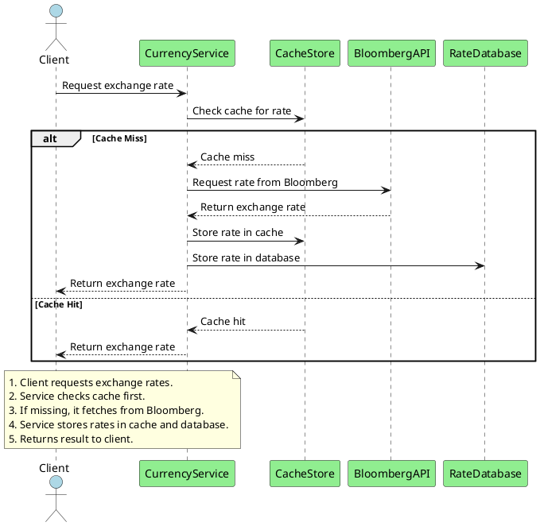

# Use Case: Load Exchange Rate Data from Subscriptions

> [!NOTE]
> 
> This use case describes the process of loading real-time exchange rate data from two external data providers, 
> **Bloomberg** and **Yahoo**, which are integrated into our Currency Service. 
> The service fetches exchange rates for different currency pairs, ensuring that the data is accurate and up to date. 
> These exchange rates are then cached and stored in the database for future reference.

## Flow

1. **Request Data**:  
  The Currency Service initiates a request to fetch real-time exchange rate data from either **Bloomberg** or **Yahoo** based on the currency pair specified by the user or system.

2. **Handle Responses**:  
   - If the requested exchange rate data is available in the **Cache**, it is retrieved from the cache.
   - If the data is not in the cache, the service sends a request to **Bloomberg** or **Yahoo** to fetch the current exchange rates.
   - Upon receiving the data from the subscription, the rates are stored in both the **Cache** and the **Rate Database** for future requests.

4. **Update System**:  
   The service updates the **Cache** and **Rate Database** with the latest exchange rate data. This ensures that subsequent requests for the same currency pair can be quickly fulfilled from the cache, reducing load on external data providers.

5. **Return Response**:  
   The system returns the exchange rate to the client that initiated the request, either from the cache or the newly fetched data.

## Components Involved

- **Currency Service**: Core service responsible for handling requests and orchestrating the process of fetching and caching exchange rate data.
- **Bloomberg API**: External service providing real-time exchange rate data.
- **Yahoo API**: Alternative external service providing real-time exchange rate data.
- **Cache Store**: Used for storing frequently requested exchange rate data to reduce latency and external API usage.
- **Rate Database**: Stores historical exchange rate data for reporting and long-term access.

## Sequence Diagram

### User Interaction Diagram

## Error Handling

In the Currency Service, several error conditions can arise while fetching and caching exchange rate data from external providers. Below are the key error handling strategies:

### 1. API Failure

If one of the external APIs (Bloomberg or Yahoo) fails or is unavailable, the service will attempt the following:
- **Fallback**: If Bloomberg API fails, the service will attempt to retrieve data from Yahoo API and vice versa.
- **Retries**: The service will implement retries with exponential backoff to avoid overwhelming the external providers in case of temporary failures.

### 2. Cache Miss

If the requested exchange rate data is not found in the **Cache**:
- The service will proceed to fetch the required data from the external APIs (Bloomberg or Yahoo).
- After fetching the data, the service will store the new exchange rates in both the **Cache** and the **Rate Database** to handle future requests efficiently.

### 3. Rate Limit Exceeded

When the service exceeds the rate limits of external providers:
- **Rate limiting**: The service will track API usage and implement rate limiting to avoid sending excessive requests to Bloomberg or Yahoo.
- **Backoff**: The system will employ retries with an exponential backoff to handle rate limit breaches gracefully.
- **Queueing**: If rate limits are hit, requests can be queued until the limits are reset, ensuring that exchange rate requests are not lost.

### 4. Invalid Parameters

In cases where invalid parameters (such as an unsupported currency pair) are provided in the request:
- The service will respond with a `400 Bad Request` error, indicating that the request parameters were incorrect.
- The error response will include a detailed message about the specific issue, allowing the client to correct the input.

### 5. Database or Cache Failures

If there is an issue with storing or retrieving data from the **Rate Database** or **Cache**:
- **Fallback to API**: If the cache or database is unavailable, the service will fallback to fetching data directly from the external APIs.
- **Error logging**: These errors will be logged for monitoring and potential intervention by the operations team.

---

These strategies ensure that the system remains resilient and provides a seamless experience to the end user despite potential failures.
