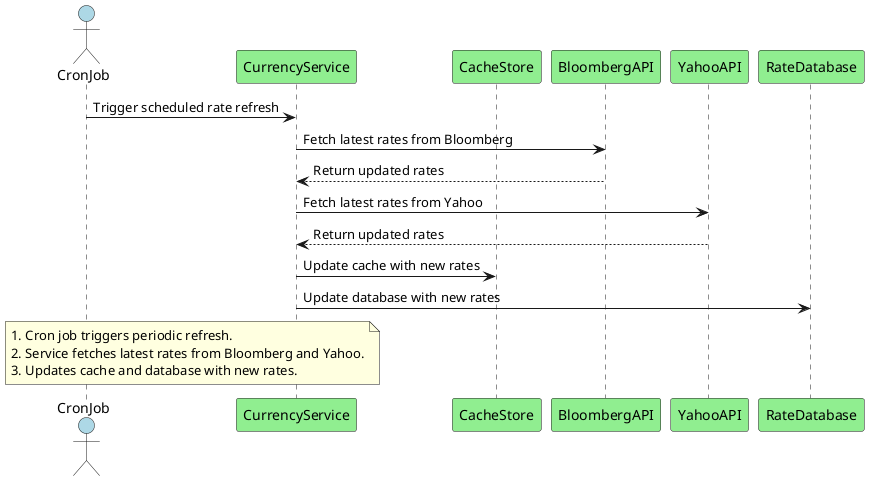

# Use Case: Scheduled Updates Rate Data from Subscriptions via Cron Job

> [!NOTE]
> 
> This use case covers the scheduled update process where a cron job runs at predefined intervals to 
> refresh exchange rate data from Bloomberg and Yahoo APIs, ensuring that the data is up to date.

## Flow

1. **Scheduled Trigger**:  
   A cron job is set up to run at regular intervals (e.g., hourly). This job triggers the Currency Service to refresh exchange rate data from external providers. The purpose is to keep the system's cache and database populated with the latest rates, reducing the need to make API calls for every user request.

2. **Fetch Exchange Rates**:  
   The Currency Service executes the `load_exchange_rates` use case to fetch exchange rates from both **Bloomberg** and **Yahoo** APIs. 
   By using this [Load Exchange Rate Data from Subscriptions](#use-case-load-exchange-rate-data-from-subscriptions) use case, it ensures that the system maintains an up-to-date set of exchange rates.

3. **Handle API Responses**:
   - **Success**: If the API calls to **Bloomberg** and **Yahoo** are successful, the service retrieves the updated exchange rate data.
   - **Failure and Fallback**: If one API fails or is unavailable, the service will attempt to use the alternative provider. Additionally, it implements retries with exponential backoff to handle transient failures and avoid overwhelming the external providers.

4. **Logging and Monitoring**:  
   Throughout the process, the service logs the activities and any errors encountered, such as API failures or rate limit exceedances. This logging is crucial for monitoring the health of the system and for debugging issues when they occur.

5. **Completion**:  
   Once the data has been fetched, processed, and stored, the cron job execution is considered complete. The service waits until the next scheduled interval to perform another update.

## Sequence Diagram

### Cron Job Interaction Diagram

