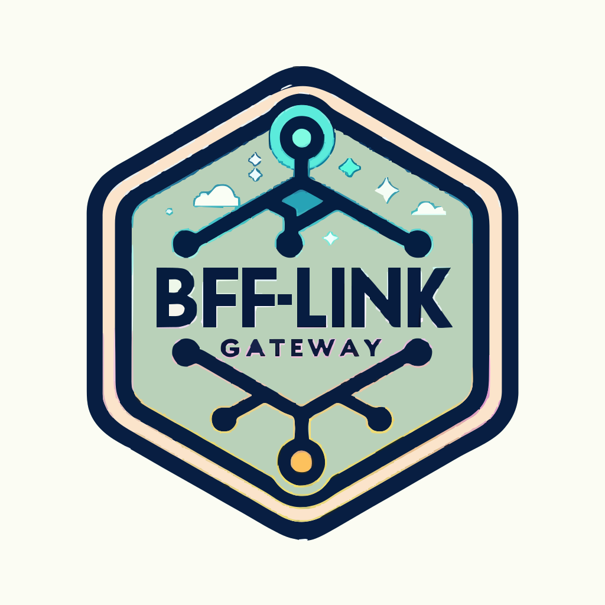

## BFF: API Gateway for web clients



> [!NOTE]
> This is a BFF service for web clients
> 
> **HTTP REST API:** Implemented using 'chi' for optimal integration and high performance.

### Docs

- [CONTRIBUTING.md](./docs/CONTRIBUTING.md) - How to contribute?
- [API](./infrastructure/http/api/api.yaml) - API documentation in Swagger format
- [Postman link](./docs/postman/shortlink.postman_collection.json) for test HTTP API
- [Swagger UI](https://shortlink-org.gitlab.io/shortlink)
- [ENV configuration](./docs/env.md) - ENV variables for configuration

### ADR

- [ADR-0001](./docs/ADR/decisions/0001-init.md) - Init project
- [ADR-0002](./docs/ADR/decisions/0002-use-oapi-codegen.md) - Use `oapi-codegen` to generate API code

### Architecture

```plantuml
@startuml
!include https://raw.githubusercontent.com/plantuml-stdlib/C4-PlantUML/master/C4_Container.puml

LAYOUT_WITH_LEGEND()

title C4: Context diagram for bff-link

Person(customer, "Customer", "Uses our service")
Container(api_gateway, "bff-link", "Docker", "Handles incoming user requests and routes them to appropriate services.")
Container_Ext(identity_service, "Identity & User Management", "Docker", "Manages user identities and authentication.")
System_Boundary(bff, "Internal Services") {
    Container_Ext(link_service, "Link", "Docker", "Provides CRUD operations for links.")
    Container_Ext(billing_service, "Billing", "Docker", "Handles billing and payment operations.")
    Container_Ext(rbac_service, "RBAC & ABAC", "Docker", "Manages role-based and attribute-based access control.")
}

Rel(customer, identity_service, "Login/Logout")
Rel_R(customer, api_gateway, "Request /api")
Rel_R(api_gateway, identity_service, "Check token")
Rel(api_gateway, link_service, "Proxy")
Rel(api_gateway, billing_service, "Proxy")
Rel(link_service, rbac_service, "Permission")
Rel(billing_service, rbac_service, "Permission")

SHOW_LEGEND()
@enduml
```
