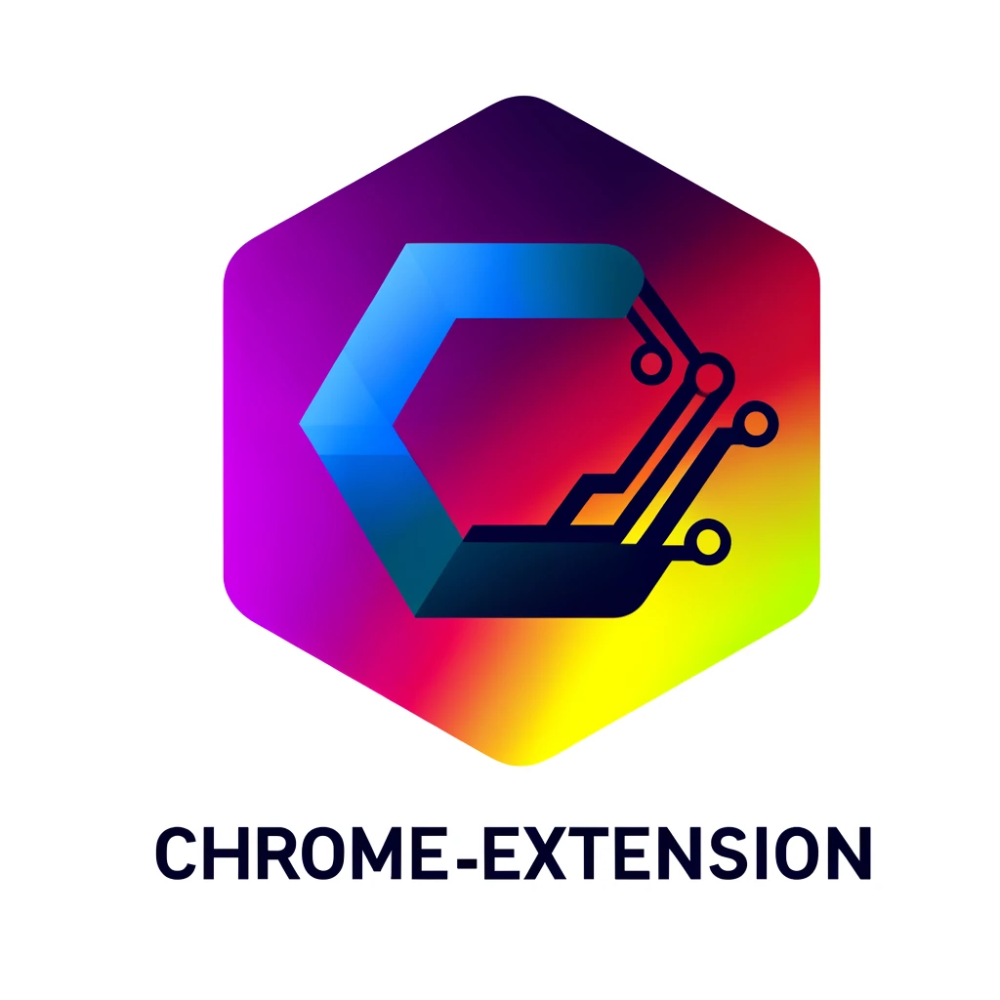

## Chrome Extension - ShortLink

ShortLink is a Chrome extension that allows you to parse the current page and create a short link automatically.

## Features

- Parses the current webpage to find all links
- Allows saving of links for future reference
- Provides a user-friendly interface to manage links

## Tech Stack

- React - A JavaScript library for building user interfaces
- WXT - A lightweight framework for building web extensions

## Usage

1. Navigate to a webpage and click on the ShortLink extension icon
2. Click on `Parse links` to find all links on the current page
3. Click `Save` next to a link to save it for future reference
