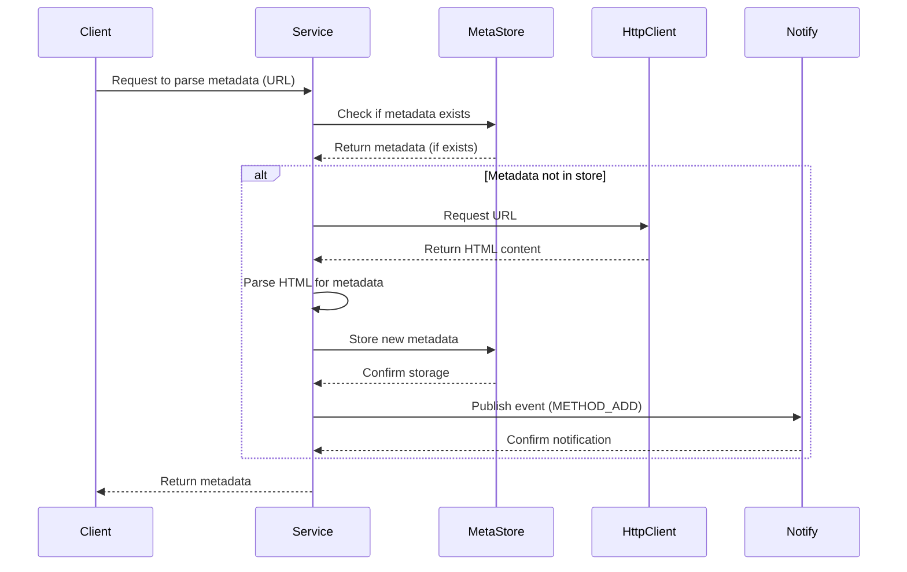

## UC-1: Parse metadata from URL

```mermaid
sequenceDiagram
  participant C as Client
  participant S as Service
  participant MetaStore as MetaStore
  participant HttpClient as HttpClient
  participant Notify as Notify

  C->>S: Request to parse metadata (URL)
  S->>MetaStore: Check if metadata exists
  MetaStore-->>S: Return metadata (if exists)
  alt Metadata not in store
    S->>HttpClient: Request URL
    HttpClient-->>S: Return HTML content
    S->>S: Parse HTML for metadata
    S->>MetaStore: Store new metadata
    MetaStore-->>S: Confirm storage
    S->>Notify: Publish event (METHOD_ADD)
    Notify-->>S: Confirm notification
  end
  S-->>C: Return metadata
```
