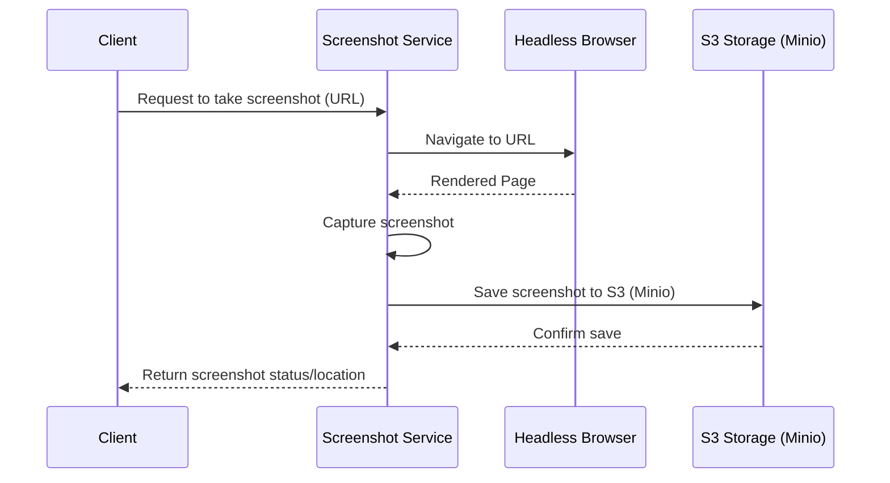

## UC-2: Made screenshot from URL

```mermaid
sequenceDiagram
  participant C as Client
  participant S as Screenshot Service
  participant Browser as Headless Browser
  participant S3 as S3 Storage (Minio)
  
  C->>S: Request to take screenshot (URL)
  S->>Browser: Navigate to URL
  Browser-->>S: Rendered Page
  S->>S: Capture screenshot
  S->>S3: Save screenshot to S3 (Minio)
  S3-->>S: Confirm save
  S-->>C: Return screenshot status/location
```
