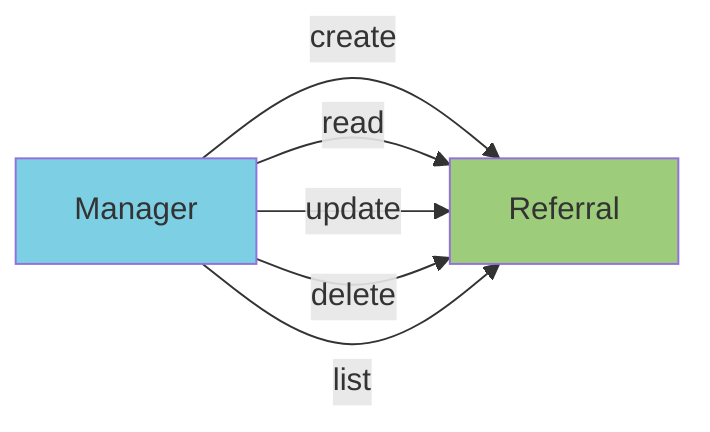

## Use Case: UC-1 CRUD referral

### Description

CRUD operations for referral:

  * Create referral 
  * Read referral
  * Update referral
  * Delete referral
  * List referrals

### Actors

  * Manager
  * Referral

### Flow of events

