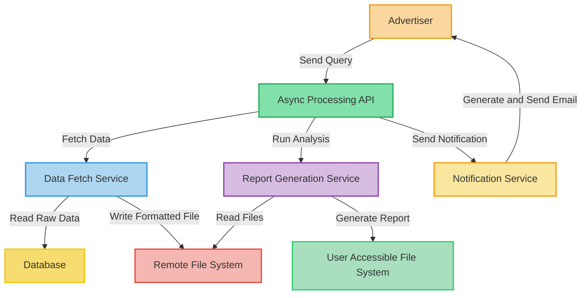

# 1. Init project.

Date: 2023-11-03

## Status

Accepted

## Context

The need to generate reports for customers in a scalable and reliable manner is paramount.

## Decision

Snap decided to embrace the Temporal open-source project, a microservice orchestration platform that can run mission-critical code at any scale. 
Temporal addresses the orchestration problem by preserving workflow states and coordinating execution through distributed queues. 
This solution allows for a centralized orchestration solution that helps in tracking system states across services.

## Consequences

1. **Reliability & Resilience**: System states are preserved, enabling recovery from potential downtimes.
2. **Efficiency**: Engineers can emphasize core business logic.

## Microservice Workflow and Descriptions

- **Data Fetching Service**: Fetches raw data based on queries, performs preprocessing, and generates formatted files. Processing times can vary based on the query.
- **Report Generation Service**: Reads the formatted files, conducts data analysis, and produces a downloadable report stored in a user-accessible file system.
- **Notification Service**: Sends notifications to customers when their reports are ready.
