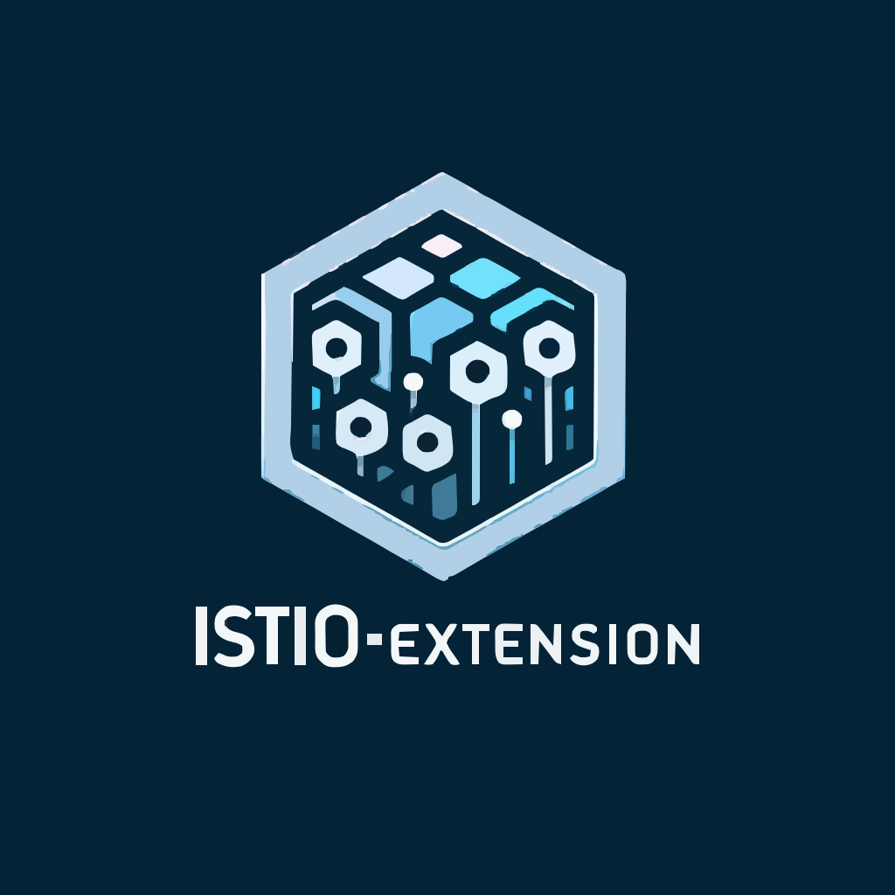

## Istio extension

> [!NOTE]
> It's plugins for Istio that are written in Go and compiled to WebAssembly.

| Name                     | Description                                                   |
|--------------------------|---------------------------------------------------------------|
| [shortlink](./shortlink) | A simple example of an Istio extension that shortens the URL. |

### References

- [TinyGo](https://tinygo.org/)
- [Istio: wasm-plugin](https://istio.io/latest/docs/reference/config/proxy_extensions/wasm-plugin/)
- Tutorial:
  - [Writing an Istio WASM Plugin in Go for migrating 100s of services to new auth strategy (Part 1)](https://zendesk.engineering/writing-an-istio-wasm-plugin-in-go-for-migrating-100s-of-services-to-new-auth-strategy-part-1-cd551e1455d7)
  - [Example using with EnvoyFilter](https://gitverse.ru/kozlov.a.e/wasm-gofunc/content/master/conf/envoy_filter.yml)
