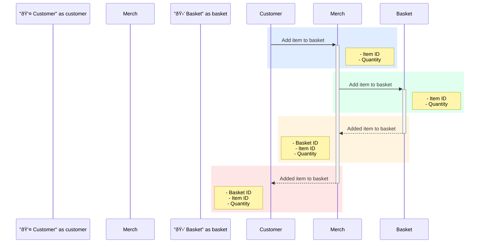
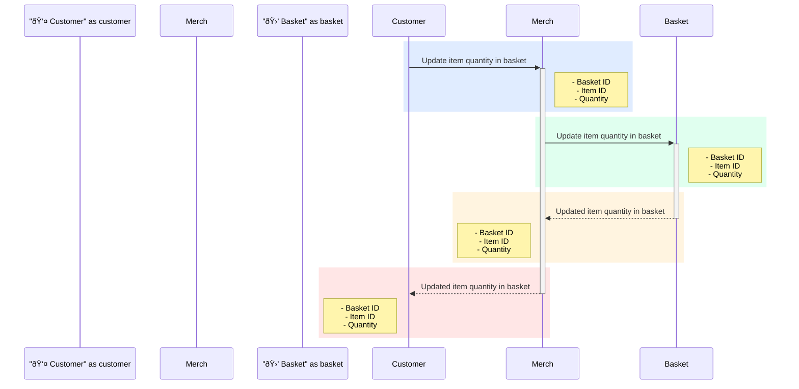
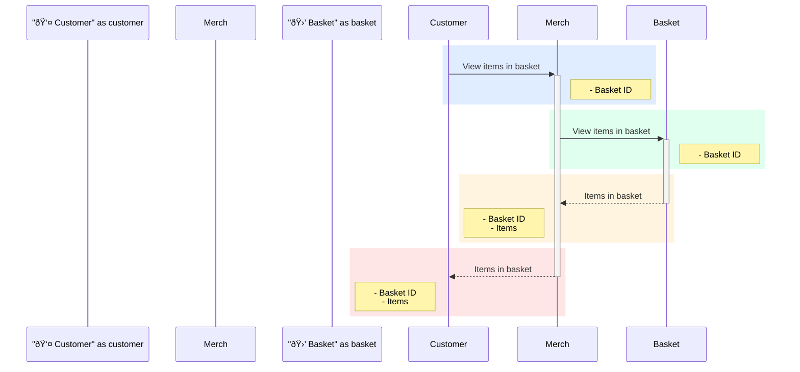
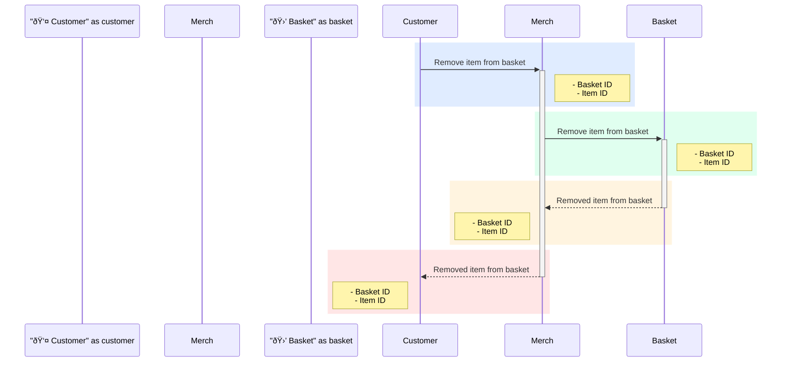

## Use Case: UC-3 Use Basket

### Add item to basket

```mermaid
sequenceDiagram
    participant "👤 Customer" as customer
    participant merch as Merch
    participant "🛒 Basket" as basket
  
    rect rgb(224, 236, 255)
        Customer->>+Merch: Add item to basket
        Note right of Merch: - Item ID<br>- Quantity
    end
  
    rect rgb(224, 255, 239)
        Merch->>+Basket: Add item to basket
        Note right of Basket: - Item ID<br>- Quantity
    end
  
    rect rgb(255, 244, 224)
        Basket-->>-Merch: Added item to basket
        Note left of Merch: - Basket ID<br>- Item ID<br>- Quantity
    end
  
    rect rgb(255, 230, 230)
        Merch-->>-Customer: Added item to basket
        Note left of Customer: - Basket ID<br>- Item ID<br>- Quantity
    end
```

### Update item quantity in basket

```mermaid
sequenceDiagram
    participant "👤 Customer" as customer
    participant merch as Merch
    participant "🛒 Basket" as basket

    rect rgb(224, 236, 255)
        Customer->>+Merch: Update item quantity in basket
        Note right of Merch: - Basket ID<br>- Item ID<br>- Quantity
    end
  
    rect rgb(224, 255, 239)
        Merch->>+Basket: Update item quantity in basket
        Note right of Basket: - Basket ID<br>- Item ID<br>- Quantity
    end
  
    rect rgb(255, 244, 224)
        Basket-->>-Merch: Updated item quantity in basket
        Note left of Merch: - Basket ID<br>- Item ID<br>- Quantity
    end
  
    rect rgb(255, 230, 230)
        Merch-->>-Customer: Updated item quantity in basket
        Note left of Customer: - Basket ID<br>- Item ID<br>- Quantity
    end
```

### View items in basket

```mermaid
sequenceDiagram
    participant "👤 Customer" as customer
    participant merch as Merch
    participant "🛒 Basket" as basket

    rect rgb(224, 236, 255)
        Customer->>+Merch: View items in basket
        Note right of Merch: - Basket ID
    end
  
    rect rgb(224, 255, 239)
        Merch->>+Basket: View items in basket
        Note right of Basket: - Basket ID
    end
  
    rect rgb(255, 244, 224)
        Basket-->>-Merch: Items in basket
        Note left of Merch: - Basket ID<br>- Items
    end
  
    rect rgb(255, 230, 230)
        Merch-->>-Customer: Items in basket
        Note left of Customer: - Basket ID<br>- Items
    end
```

### Remove item from basket

```mermaid
sequenceDiagram
    participant "👤 Customer" as customer
    participant merch as Merch
    participant "🛒 Basket" as basket

    rect rgb(224, 236, 255)
        Customer->>+Merch: Remove item from basket
        Note right of Merch: - Basket ID<br>- Item ID
    end

    rect rgb(224, 255, 239)
        Merch->>+Basket: Remove item from basket
        Note right of Basket: - Basket ID<br>- Item ID
    end

    rect rgb(255, 244, 224)
        Basket-->>-Merch: Removed item from basket
        Note left of Merch: - Basket ID<br>- Item ID
    end

    rect rgb(255, 230, 230)
        Merch-->>-Customer: Removed item from basket
        Note left of Customer: - Basket ID<br>- Item ID
    end
```
