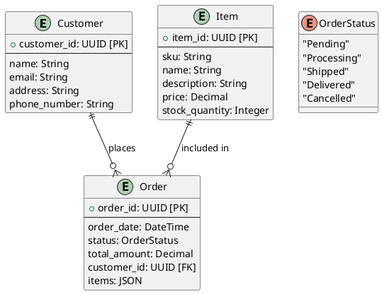

# 3. ERD

Date: 2024-07-29

## Status

Draft

## Context

We need to understand the relationships between entities in our system.

## Decision

Adopt an Entity-Relationship Diagram (ERD) to model the relationships between entities in our system. 
This diagram will show how entities are related to each other and the cardinality of those relationships.

## Consequences

Provides a visual representation of the relationships between entities in the system, aiding in understanding the data model and database design.
