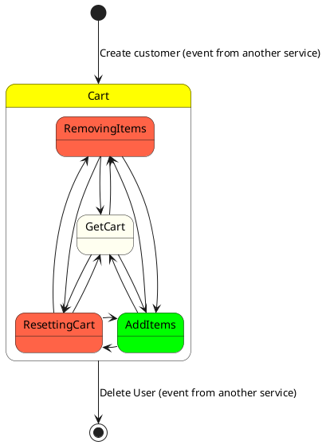
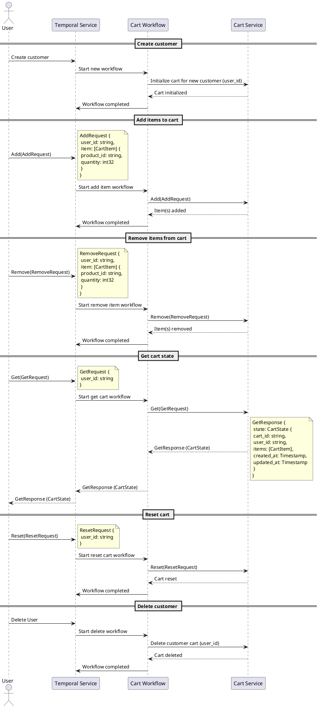

## UC-1: Cart workflows

```plantuml
@startuml
skinparam state {
    BackgroundColor<<CartState>> Yellow
    BackgroundColor<<Add>> Lime
    BackgroundColor<<Remove>> Tomato
    BackgroundColor<<Get>> Ivory
}

[*] --> Cart : Create customer (event from another service)

state Cart <<CartState>> {
  AddItems<<Add>> -left-> ResettingCart<<Remove>>
  AddItems<<Add>> -down-> RemovingItems<<Remove>>
  AddItems<<Add>> --right--> GetCart<<Get>>
  
  RemovingItems<<Remove>> -up-> AddItems<<Add>>
  RemovingItems<<Remove>> -left-> ResettingCart<<Remove>>
  RemovingItems<<Remove>> -right-> GetCart<<Get>>
  
  GetCart<<Get>> ---> RemovingItems<<Remove>>
  GetCart<<Get>> ---> ResettingCart<<Remove>>
  GetCart<<Get>> --left--> AddItems<<Add>>
  
  ResettingCart<<Remove>> -right-> AddItems<<Add>>
  ResettingCart<<Remove>> -up-> GetCart<<Get>>
  ResettingCart<<Remove>> -left-> RemovingItems<<Remove>>
}

Cart --> [*] : Delete User (event from another service)
@enduml
```

### Sequence Diagram

```plantuml
@startuml
actor User

participant "Temporal Service" as Temporal
participant "Cart Workflow" as CartWF
participant "Cart Service" as CartService

== Create customer ==
User -> Temporal : Create customer
Temporal -> CartWF : Start new workflow
CartWF -> CartService : Initialize cart for new customer (user_id)
CartService --> CartWF : Cart initialized
CartWF -> Temporal : Workflow completed

== Add items to cart ==
User -> Temporal : Add(AddRequest)
note right: AddRequest {\n user_id: string,\n item: [CartItem] {\n product_id: string,\n quantity: int32\n }\n}
Temporal -> CartWF : Start add item workflow
CartWF -> CartService : Add(AddRequest)
CartService --> CartWF : Item(s) added
CartWF -> Temporal : Workflow completed

== Remove items from cart ==
User -> Temporal : Remove(RemoveRequest)
note right: RemoveRequest {\n user_id: string,\n item: [CartItem] {\n product_id: string,\n quantity: int32\n }\n}
Temporal -> CartWF : Start remove item workflow
CartWF -> CartService : Remove(RemoveRequest)
CartService --> CartWF : Item(s) removed
CartWF -> Temporal : Workflow completed

== Get cart state ==
User -> Temporal : Get(GetRequest)
note right: GetRequest {\n user_id: string\n}
Temporal -> CartWF : Start get cart workflow
CartWF -> CartService : Get(GetRequest)
CartService --> CartWF : GetResponse (CartState)
note right: GetResponse {\n state: CartState {\n cart_id: string,\n user_id: string,\n items: [CartItem],\n created_at: Timestamp,\n updated_at: Timestamp\n }\n}
CartWF --> Temporal : GetResponse (CartState)
Temporal --> User : GetResponse (CartState)

== Reset cart ==
User -> Temporal : Reset(ResetRequest)
note right: ResetRequest {\n user_id: string\n}
Temporal -> CartWF : Start reset cart workflow
CartWF -> CartService : Reset(ResetRequest)
CartService --> CartWF : Cart reset
CartWF -> Temporal : Workflow completed

== Delete customer ==
User -> Temporal : Delete User
Temporal -> CartWF : Start delete workflow
CartWF -> CartService : Delete customer cart (user_id)
CartService --> CartWF : Cart deleted
CartWF -> Temporal : Workflow completed

@enduml
```

