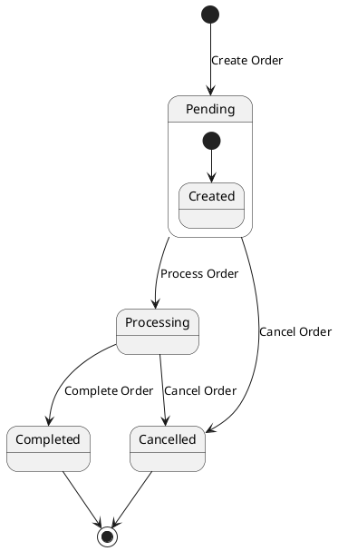
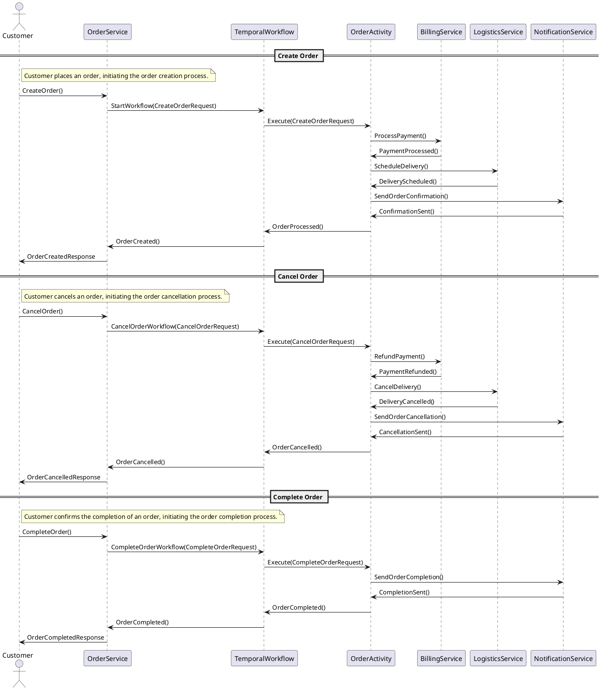

## UC-2: Order workflows

### State Diagram

```plantuml
@startuml

[*] --> Pending : Create Order

state Pending {
  [*] --> Created
}

Pending --> Processing : Process Order
Processing --> Completed : Complete Order
Processing --> Cancelled : Cancel Order
Pending --> Cancelled : Cancel Order

Completed --> [*]
Cancelled --> [*]

@enduml
```

### Sequence Diagram

```plantuml
@startuml

actor Customer
participant OrderService
participant TemporalWorkflow
participant OrderActivity
participant BillingService
participant LogisticsService
participant NotificationService

== Create Order ==
note right of Customer
Customer places an order, initiating the order creation process.
end note

Customer -> OrderService: CreateOrder()
OrderService -> TemporalWorkflow: StartWorkflow(CreateOrderRequest)
TemporalWorkflow -> OrderActivity: Execute(CreateOrderRequest)
OrderActivity -> BillingService: ProcessPayment()
BillingService -> OrderActivity: PaymentProcessed()
OrderActivity -> LogisticsService: ScheduleDelivery()
LogisticsService -> OrderActivity: DeliveryScheduled()
OrderActivity -> NotificationService: SendOrderConfirmation()
NotificationService -> OrderActivity: ConfirmationSent()
OrderActivity -> TemporalWorkflow: OrderProcessed()
TemporalWorkflow -> OrderService: OrderCreated()
OrderService -> Customer: OrderCreatedResponse

== Cancel Order ==
note right of Customer
Customer cancels an order, initiating the order cancellation process.
end note

Customer -> OrderService: CancelOrder()
OrderService -> TemporalWorkflow: CancelOrderWorkflow(CancelOrderRequest)
TemporalWorkflow -> OrderActivity: Execute(CancelOrderRequest)
OrderActivity -> BillingService: RefundPayment()
BillingService -> OrderActivity: PaymentRefunded()
OrderActivity -> LogisticsService: CancelDelivery()
LogisticsService -> OrderActivity: DeliveryCancelled()
OrderActivity -> NotificationService: SendOrderCancellation()
NotificationService -> OrderActivity: CancellationSent()
OrderActivity -> TemporalWorkflow: OrderCancelled()
TemporalWorkflow -> OrderService: OrderCancelled()
OrderService -> Customer: OrderCancelledResponse

== Complete Order ==
note right of Customer
Customer confirms the completion of an order, initiating the order completion process.
end note

Customer -> OrderService: CompleteOrder()
OrderService -> TemporalWorkflow: CompleteOrderWorkflow(CompleteOrderRequest)
TemporalWorkflow -> OrderActivity: Execute(CompleteOrderRequest)
OrderActivity -> NotificationService: SendOrderCompletion()
NotificationService -> OrderActivity: CompletionSent()
OrderActivity -> TemporalWorkflow: OrderCompleted()
TemporalWorkflow -> OrderService: OrderCompleted()
OrderService -> Customer: OrderCompletedResponse

@enduml
```
