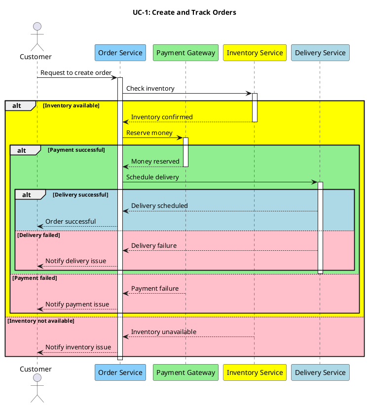

# UC-1: Create and track orders

> [!NOTE]
> This use case describes the flow of creating and tracking orders.

```plantuml
@startuml
title UC-1: Create and Track Orders

actor Customer as "Customer"
participant "Order Service" as OrderSvc #LightSkyBlue
participant "Payment Gateway" as Payment #LightGreen
participant "Inventory Service" as Inventory #Yellow
participant "Delivery Service" as Delivery #LightBlue

Customer -> OrderSvc : Request to create order
activate OrderSvc

OrderSvc -> Inventory : Check inventory
activate Inventory
alt #Yellow Inventory available
    Inventory --> OrderSvc : Inventory confirmed
    deactivate Inventory

    OrderSvc -> Payment : Reserve money
    activate Payment
    alt #LightGreen Payment successful
        Payment --> OrderSvc : Money reserved
        deactivate Payment

        OrderSvc -> Delivery : Schedule delivery
        activate Delivery
        alt #LightBlue Delivery successful
            Delivery --> OrderSvc : Delivery scheduled
            OrderSvc --> Customer : Order successful
        else #Pink Delivery failed
            Delivery --> OrderSvc : Delivery failure
            OrderSvc --> Customer : Notify delivery issue
        end
        deactivate Delivery
    else #Pink Payment failed
        Payment --> OrderSvc : Payment failure
        OrderSvc --> Customer : Notify payment issue
        deactivate Payment
    end
else #Pink Inventory not available
    Inventory --> OrderSvc : Inventory unavailable
    OrderSvc --> Customer : Notify inventory issue
    deactivate Inventory
end
deactivate OrderSvc

@enduml
```
