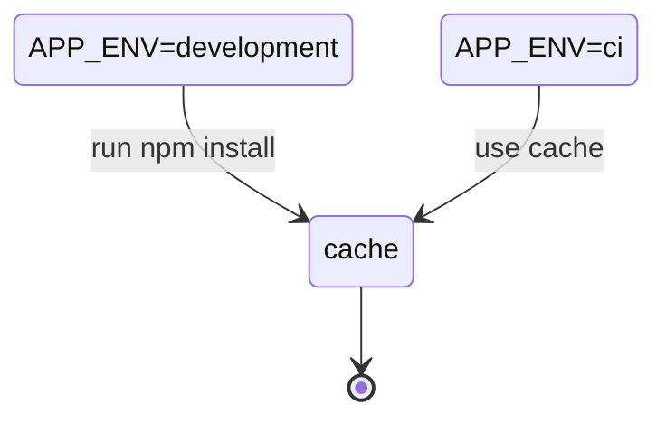

## Landing


> [!NOTE]
> This service made starting page for navigation to all services our platform.

### Getting Started

First, run the development server:

```bash
pnpm nx dlx dev landing
```

### ENV

Use `.env` file in `packages/landing` directories for setting your UI

### Stack

- NextJS (SSR/Static generate content)
  - ReactJS
- Pretty code base
  - Typescript
  - ESLint/Prettier
- Cypress (for E2E)

### Dockerfile



**Run:**

```bash
docker build -t test --build-arg APP_ENV=ci -f ops/dockerfile/boundary_ui/landing.Dockerfile .
```

### ChatGPT || OpenAI

This service support [ChatGPT](https://chat.openai.com/chat) as plugin.  
You can use it for ChatGPT by link `https://shortlink.best/.well-known/ai-plugin.json`

You can read official docs [here](https://platform.openai.com/docs/plugins/getting-started/running-a-plugin) for more information.

### Learn More

To learn more about Next.js, take a look at the following resources:

- [Next.js Documentation](https://nextjs.org/docs) - learn about Next.js features and API.
- [Learn Next.js](https://nextjs.org/learn) - an interactive Next.js tutorial.

You can check out [the Next.js GitHub repository](https://github.com/vercel/next.js/) - your feedback and contributions are welcome!

---

This is a [Next.js](https://nextjs.org/) project bootstrapped with [`create-next-app`](https://github.com/vercel/next.js/tree/canary/packages/create-next-app).
