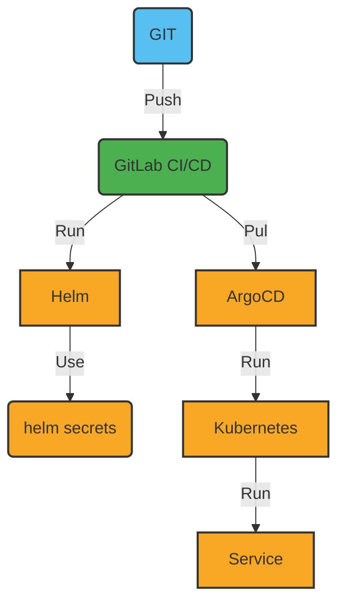

# 13. Security

Date: 2023-01-16

## Status

Accepted

## Context

We need to encrypt secret data for deployment to enhance the security of our application.

## Decision

### Secrets Management

We will use [SOPS](https://github.com/mozilla/sops) to encrypt secret data, ensuring it is protected during deployment.

- for **HELM** we will use [helm-secrets](https://github.com/jkroepke/helm-secrets/wiki/Usage) plugin.
- for **ArgoCD** we use - [Argo CD Integration](https://github.com/jkroepke/helm-secrets/blob/main/docs/ArgoCD%20Integration.md).

### Kubernetes Security

We will use [kubescape](https://github.com/kubescape/kubescape) to scan our cluster for security issues.

### Supply chain

We will use [SLSA](https://slsa.dev/) to ensure that our supply chain is secure.

We add flags `--sbom=true` and `--provenance=true` for docker build.

## Consequences

+ We will need to use SOPS to decrypt secret data before deploying.
+ We will need to use kubescape to scan our cluster for security issues.
+ We will need to use SLSA to ensure that our supply chain is secure.
