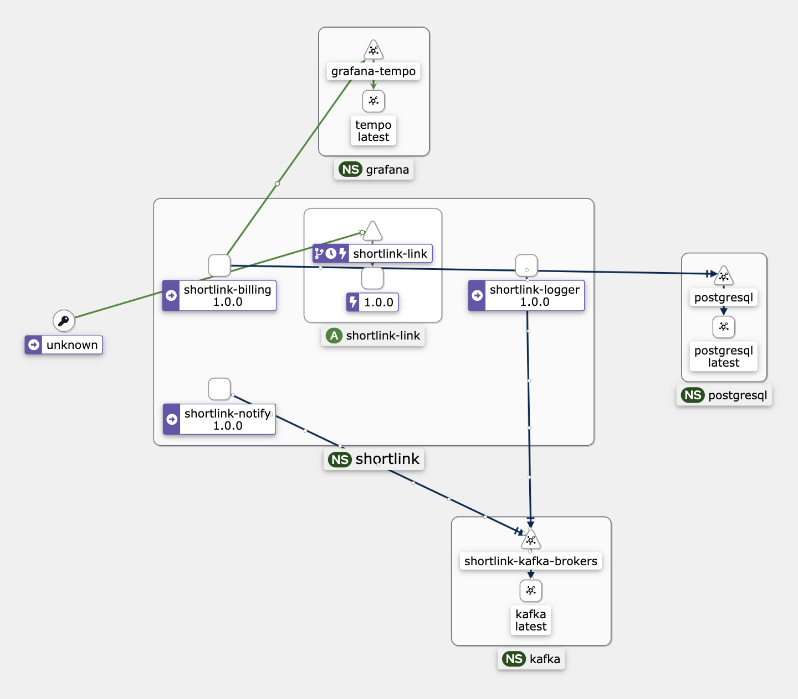

# 14. Standardizing Observability Tools

Date: 2023-01-21

## Status

Accepted

## Context

To maintain a consistent and effective approach to observability across our systems, 
we need to establish standard tools for monitoring, tracing, and logging.

## Decision

### Tracing

We use [OpenTelemetry](https://opentelemetry.io/) for tracing and metrics.

### Kiali && Istio

+ [Kiali](https://kiali.io/) - Kiali is an open source project for service mesh observability, 
  configuration, and validation. It provides dashboards, observability, and control of the service mesh and your microservices.

## Consequences

+ We use [OpenTelemetry](https://opentelemetry.io/) for tracing and metrics.
+ **[Prometheus](https://prometheus.io/)** - Monitoring system
  + prometheus-operator
    + notify: slack, email, telegram
+ **Grafana stack (LGTM)**
  * [Grafana](https://github.com/grafana/grafana), the open and composable observability and data visualization platform.
  * [Loki](https://github.com/grafana/loki), like Prometheus, but for logs.
  * [Tempo](https://grafana.com/docs/tempo/latest/), a high volume, high throughput distributed tracing system.
  * [Grafana](https://github.com/grafana/grafana), the open and composable observability and data visualization platform.
  + [OnCall](https://grafana.com/oss/oncall/) - On-call scheduling
  + [Pyroscope](https://grafana.com/oss/pyroscope/) - Profiling and flame graphs

### Common prometheus metrics

+ Add default metrics for prometheus
+ [Exposing the software version to Prometheus](https://www.robustperception.io/exposing-the-software-version-to-prometheus)
  + Example: [Add opencost_build_info metric](https://github.com/opencost/opencost/pull/1577/files) 

### Docs/Articles

+ [The RED Method: How to Instrument Your Services](https://grafana.com/blog/2018/08/02/the-red-method-how-to-instrument-your-services/)
+ [Do you need an OpenTelemetry Collector?](https://grafana.com/blog/2023/11/21/do-you-need-an-opentelemetry-collector/)

