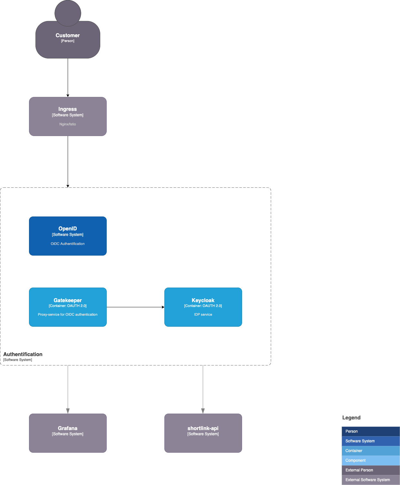

# 15. authentication

Date: 2023-01-30

## Status

Accepted

## Context

We need to decide how we will authenticate users. We have a few options:

* **OIDC** (OpenID Connect)
  * **OAuth 2.0**
    * [RFC 6749](https://tools.ietf.org/html/rfc6749) - The OAuth 2.0 Authorization Framework
    * [RFC 6750](https://tools.ietf.org/html/rfc6750) - The OAuth 2.0 Authorization Framework: Bearer Token Usage
    * [RFC 8414](https://tools.ietf.org/html/rfc8414) - OAuth 2.0 Authorization Server Metadata
    * [RFC 8705](https://tools.ietf.org/html/rfc8705) - OAuth 2.0 Token Exchange
    * [RFC 8693](https://tools.ietf.org/html/rfc8693) - OAuth 2.0 Device Authorization Grant
  * **JWT**
    * [RFC 7515](https://tools.ietf.org/html/rfc7515) - JSON Web Signature (JWS)
    * [RFC 7516](https://tools.ietf.org/html/rfc7516) - JSON Web Encryption (JWE)
    * [RFC 7519](https://tools.ietf.org/html/rfc7519) - JSON Web Token (JWT)
    * [RFC 7523](https://tools.ietf.org/html/rfc7523) - JSON Web Token (JWT) Profile for OAuth 2.0 Client Authentication and Authorization Grants
* **2FA**

## Decision

We want use third-party authentication, because it is more secure and we don't support this service.

We research next third-party authentication:
+ [Keycloak](https://www.keycloak.org/)
+ [ory/hydra](https://www.ory.sh/hydra/)
+ [dexidp/dex](https://dexidp.io/)

## Consequences

Use this scheme:

### Step 1. Try to use Keycloak

1. Install Keycloak
2. Try to use Keycloak
3. Made decision about use Keycloak and update this ADR
