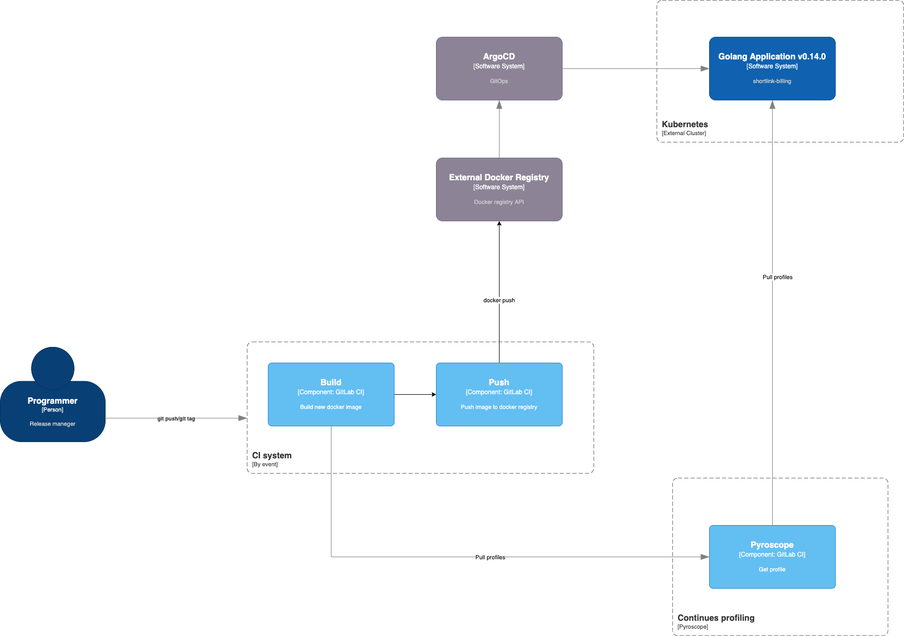

# 17. Profile-guided optimization

Date: 2023-02-15

## Status

Accepted

## Context

Profile-guided optimization (PGO), also known as feedback-directed optimization (FDO), is a compiler optimization 
technique that feeds information (a profile) from representative runs of the application back into to the compiler 
for the next build of the application, which uses that information to make more informed optimization decisions. 
For example, the compiler may decide to more aggressively inline functions which the profile indicates 
are called frequently.

In Go, the compiler uses CPU pprof profiles as the input profile, such as from runtime/pprof or net/http/pprof.

As of Go 1.20, benchmarks for a representative set of Go programs show that building with PGO improves performance 
by around 2-4%. We expect performance gains to generally increase over time as additional optimizations take 
advantage of PGO in future versions of Go.

### Additional tutorials and docs

- [Profile-guided optimization](https://go.dev/doc/pgo)
- [What is continuous profiling?](https://www.cncf.io/blog/2022/05/31/what-is-continuous-profiling/)
- [What happens when you profile a continuous profiler?](https://pyroscope.io/blog/profile-continuous-profiler/)

## Decision

We will use Pyroscope for continuous profiling.


We will use PGO for our application.

### Pipeline

1. Run application and connect continues profiling
2. Use continues profiling by [Pyroscope](https://pyroscope.io/docs/)
   1. Load profile
   2. Merge profile for application
3. Build docker image with new PGO profile
4. Push to registry
5. Deploy application



## Consequences

We will get a little faster application.

The standard approach is to store a pprof CPU profile with filename `default.pgo` in 
the main package directory of the profiled binary, and build with go build -pgo=auto, 
which will pick up default.pgo files automatically.

### Example work with pgo

```
# Get profile
$> curl -s  http://localhost:7071/debug/pprof/profile\?seconds\=30 > ./cpu.out
# Merging profiles
$> go tool pprof -proto a.pprof b.pprof > default.pgo
# Build
$> go build -o app -pgo=auto ./internal/services/api/cmd/api.go
```
