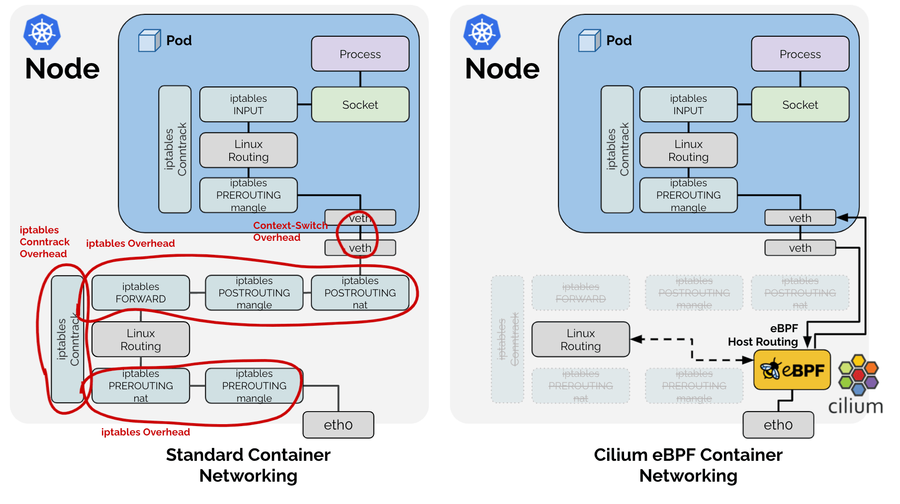

# 18. Kubernetes network

Date: 2023-03-07

## Status

Accepted

## Context

As we plan the network configuration for our Kubernetes cluster, we need to consider the various network plugins 
available and select the one that best meets our needs.

## Decision

After evaluating several network plugins, we have decided to use Cicilium as our network plugin. 
We made this decision based on the following factors:

- **eBPF**: Cicilium uses eBPF (extended Berkeley Packet Filter), which provides efficient and flexible packet filtering and 
  allows us to perform complex network operations.
- **L7** policy: Cicilium includes a Layer 7 policy engine, which allows us to enforce 
  network policies at the application layer.
- **Observability**: Cicilium provides a comprehensive set of observability tools, including 
  network metrics, network traces, and network policy enforcement reports.
- **Security**: Cicilium provides a set of security features, including encryption, 
  identity-based access control, and network segmentation.
- **Ease of use**: Cicilium is easy to install and configure, and it integrates well with 
  Kubernetes.
- **Community**: Cicilium is an open source project with a large and active community.
- **Support**: Cicilium is supported by the CNCF and has a large number of contributors.

### Docs

- [Cilium](https://cilium.io/)
- [Cilium for Kubernetes networking: Why we use it and why we love it](https://blog.palark.com/why-cilium-for-kubernetes-networking/)

## Consequences

By selecting Cicilium as our network plugin, we expect to achieve the following benefits:

- Improved network performance and efficiency, thanks to eBPF

- Better security and policy enforcement, thanks to the L7 policy engine

- Simplified network management and troubleshooting
- Improved observability and monitoring
