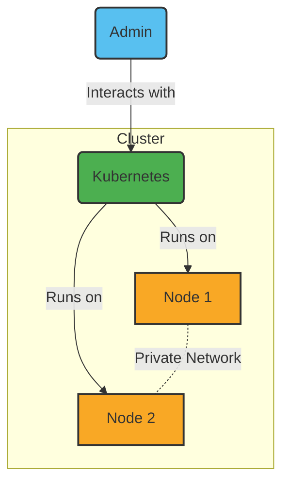

# 22. kubernetes

Date: 2023-04-22

## Status

Accepted

## Context

We need to decide how to deploy our services to Kubernetes.

## Decision

For the deployment of our services to Kubernetes, we will use the Helm package manager.

### Hardware Configuration

We will use the following hardware:

### CI/CD

We will use the GitLab CI/CD to deploy our services to Kubernetes.

### GitOps

We will use ArgoCD to manage our Kubernetes cluster.

 - [Introduction to Continuous Delivery and GitOps using Argo CD](https://academy.akuity.io/courses/gitops-argocd-intro)

### Secrets

We will use SOPS to manage our secrets.

## Consequences

What becomes easier or more difficult to do and any risks introduced by the change that will need to be mitigated.
