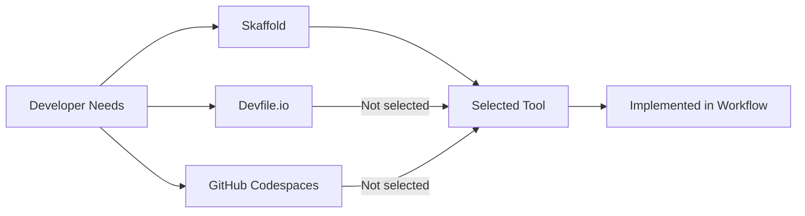

# ADR 24: Selecting a Development Tool for Remote Kubernetes Development

Date: 2023-05-24

## Status

Accepted

## Context

With the growing complexity of our development team and the expanding use of Kubernetes for our application deployments, 
we have identified the need for a tool that supports efficient and seamless remote development. 
The tool we select should facilitate developing, debugging, and deploying applications from local machines to remote 
Kubernetes environments. After careful consideration, we have narrowed down our options to Skaffold, Devfile.io, 
and GitHub Codespaces.

- [Skaffold](https://skaffold.dev/) is a development tool designed to facilitate rapid local Kubernetes development. 
  It's lightweight and supports the entire development lifecycle.
  - [Example](../../../skaffold.yaml)
- [Devfile.io](https://devfile.io/) provides a shareable, flexible, and standardized developer workspace definition 
  that's optimized for cloud-native environments.
  - [Example](./proof/ADR-0024/devfile.yaml)
- [GitHub Codespaces](https://github.com/features/codespaces) offers a fully-configurable, cloud-hosted development 
  environment that can be accessed directly from Visual Studio Code, a web browser, or the GitHub Desktop app.

## Decision

After evaluating the options, we have decided to adopt Skaffold. This decision was primarily based on Skaffold's 
ability to support rapid local Kubernetes development, its lightweight nature, and its capability to facilitate 
the entire development lifecycle, which aligns most closely with our current needs.

## Consequences

The adoption of Skaffold is expected to simplify our development workflows and accelerate our processes. 
However, it will require the team to undergo training to effectively use the tool. 
Additionally, we will need to monitor the resource usage of Skaffold to ensure it does not negatively impact our system. 
Lastly, we should stay updated on the development and changes in Skaffold, Devfile.io, 
and GitHub Codespaces to be prepared to reassess our decision if the need arises.

Below is a Mermaid diagram illustrating our decision-making process:

In this diagram, "A" represents our identified needs, "B", "C", and "D" represent the tools we considered, "E" signifies our final decision, and "F" illustrates the implementation of our decision in our workflow.
