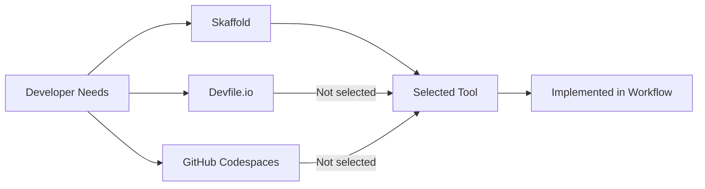

# 24. Selecting a Development Tool for Remote Machine

Date: 2023-05-24

## Status

Accepted

## Context

As our development team is growing in complexity, we need a tool that allows seamless and efficient remote development. Our focus is developing, debugging, and deploying applications on Kubernetes environments from local to remote machines. We considered three options: Skaffold, Devfile.io, and GitHub Codespaces.

- [Skaffold](https://skaffold.dev/) facilitates fast local Kubernetes development, is lightweight, and supports the full development cycle.
    - [Example](../../../skaffold.yaml)
- [Devfile.io](https://devfile.io/) provides a standardized, shareable, and flexible developer workspace definition for cloud-native environments.
    - [Example](./proof/ADR-0024/devfile.yaml)
- [GitHub Codespaces](https://github.com/features/codespaces) provides a complete, configurable development environment hosted in the cloud, which works directly from Visual Studio Code, your browser, or the GitHub Desktop app.

## Decision

We've decided to implement Skaffold. Its fast local Kubernetes development, lightweight nature, and full cycle development capabilities best align with our needs.

## Consequences

Choosing Skaffold simplifies our development workflows and should speed up processes. However, the team will need training on the tool, and we should monitor its resource usage. We'll also need to stay updated on the evolution of Skaffold, Devfile.io, and GitHub Codespaces to reassess our needs if necessary.

Here's a Mermaid schema illustrating the decision process:

In this schema, "A" represents our needs, "B", "C", and "D" are the tools we considered, "E" is our decision, and "F" is the implementation of our decision.
