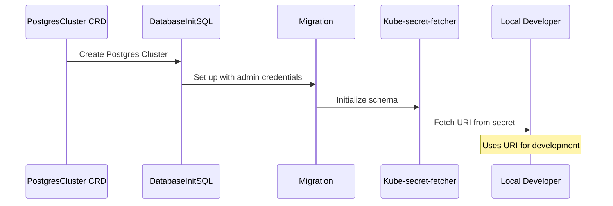

# 26. Pattern: database per service

Date: 2023-06-11

## Status

Accepted

## Context

Our system architecture is composed of various microservices. Each of these microservices has its own specific requirements, therefore necessitating its own separate database. This approach aligns with the `Database per Service` pattern, which suggests that each service should have its own private database to ensure loose coupling, high performance, and scalability.

A detailed description of the pattern can be found [here](https://microservices.io/patterns/data/database-per-service.html).

## Decision

We have decided to implement the `Database per Service` pattern in our system. We will use the CrunchyData Postgres operator for managing our Postgres databases. Each microservice will have its own Postgres database cluster created using the `PostgresCluster` Custom Resource Definition (CRD).

Here is a basic outline of the algorithm using a mermaid schema:

For managing users and databases in our Postgres clusters, we will use the guidance provided by CrunchyData, which can be found [here](https://access.crunchydata.com/documentation/postgres-operator/5.3.2/tutorial/user-management/).

## Consequences

By implementing the `Database per Service` pattern, we are able to minimize the coupling between services and provide each service with its own private data model. This improves the performance and scalability of each microservice by preventing database-related bottlenecks. It also enhances the security of our system as each service will have limited access only to its own specific data.

However, there are a few drawbacks to this approach. Firstly, it can lead to data duplication and inconsistency if the same data is required by multiple services. Secondly, it can complicate transactions that span multiple services and queries that require data from multiple services. It's important that we architect our services and their data requirements wisely to mitigate these issues.

We should also note that managing multiple databases may increase our operational complexity. The CrunchyData Postgres operator will be helpful in this regard, but we will need to ensure our team is familiar with it and prepared to manage these databases effectively.
