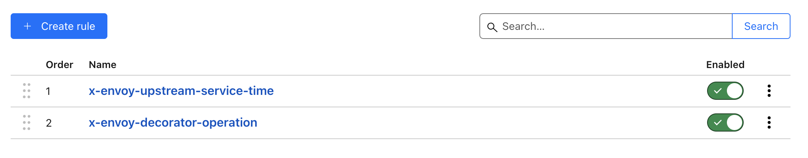

# 35. Use Cloudflare

Date: 2024-07-27

## Status

Accepted

## Context

The current infrastructure faces challenges related to security, performance, and scalability. 
With increasing traffic, there is a need for enhanced security measures to protect against DDoS attacks, 
improved performance through content delivery optimization, and better management of traffic loads. 
Cloudflare offers a comprehensive solution by providing a range of services including DDoS protection, CDN, SSL, and 
web application firewall (WAF). Additionally, integrating Cloudflare can simplify traffic management and monitoring, 
offering real-time insights and analytics.

## Decision

We have decided to integrate Cloudflare for all incoming and outgoing traffic.

### Dropping Existing Envoy Response Headers

To enhance security and prevent the exposure of internal architecture details, we will drop existing Envoy response headers. 
This will reduce the attack surface and align with Cloudflare's security protocols.

## Consequences

### Positive Consequences

- **Enhanced Security**: Cloudflare's DDoS protection, WAF, and the removal of existing Envoy headers with the introduction of new, secure headers will significantly reduce the risk of attacks.
- **Improved Performance**: The CDN will decrease latency and improve load times for users globally.
- **Simplified Traffic Management**: Centralized management of traffic through Cloudflare will provide better control and real-time insights.
- **Increased Reliability**: Cloudflare's robust infrastructure will ensure higher availability and uptime.
- **Enhanced Analytics**: Integration with Google Analytics will provide comprehensive insights into user behavior and website performance.
- **Reduced Server Load**: Cloudflare's CDN will offload traffic from origin servers, improving their performance and reducing operational costs.

### Negative Consequences

- **Dependency on Cloudflare**: Increased reliance on a third-party service for critical infrastructure.
- **Cost**: Additional expenses associated with Cloudflare's premium services and Google Analytics integration.
- **Privacy Concerns**: Additional data collection through Google Analytics may raise privacy issues which need to be managed appropriately.

