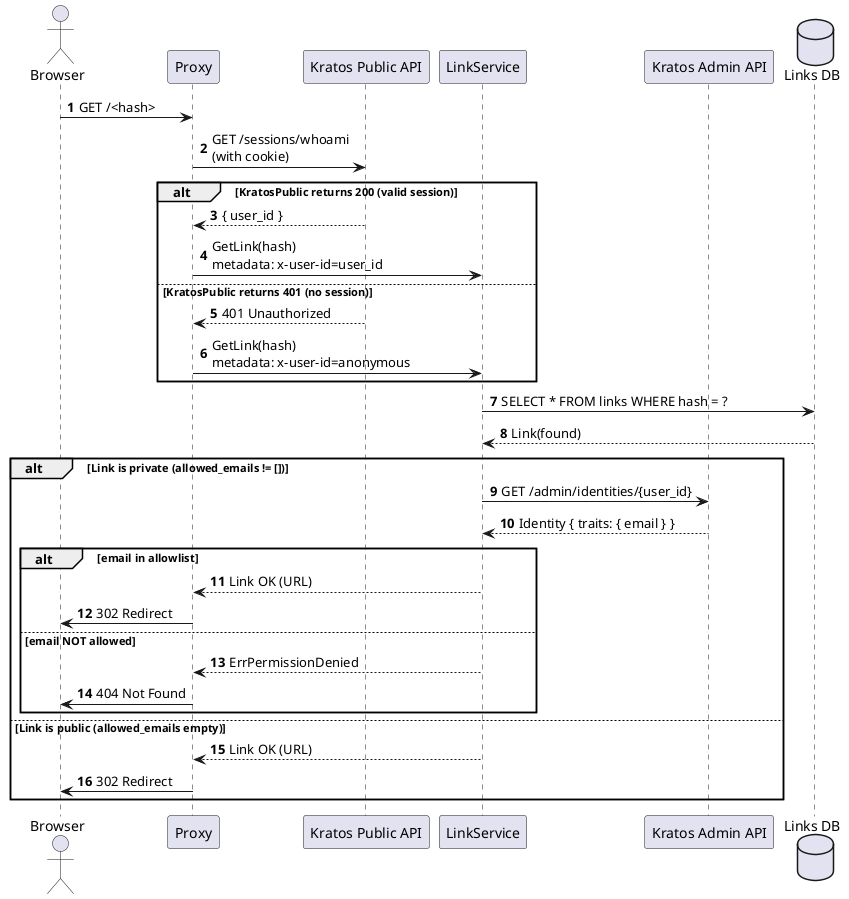

# 42. Link Privacy Control

Date: 2025-01-27

## Status

Accepted

## Context

Изначально все ссылки в системе были публичными: любой пользователь (включая анонимного) мог открыть URL вида:

```text
https://shortlink.best/<hash>
```

Пользователи запросили возможность ограничивать доступ к ссылкам, предоставляя их только определённым людям.

### Требования

- Поддержать публичные ссылки (текущая модель, backward-compatible)
- Добавить приватные ссылки, доступные по email-allowlist
- Proxy должен:
  - доставать user_id из Kratos session
  - передавать user_id в LinkService
  - не выполнять авторизацию самостоятельно
- LinkService должен:
  - проверять приватность внутри себя
- Приватные ссылки должны вести себя как Google Docs private links:
  - могут быть открыты только пользователями из allowlist
  - для остальных должен возвращаться 404 Not Found (скрытие существования)

## Decision

### 2.1. Privacy Model

Приватность определяется только по allowlist:

- **Публичная ссылка** → `allowed_emails = []`
- **Приватная ссылка** → `allowed_emails != []`

### 2.2. Domain Rules

В домене добавляется policy-слой:

```go
func (l *Link) IsPublic() bool {
    return len(l.AllowedEmails) == 0
}

func (l *Link) CanBeViewedByEmail(email string) bool {
    if l.IsPublic() {
        return true
    }

    normalized := normalizeEmail(email)
    for _, e := range l.AllowedEmails {
        if normalizeEmail(e) == normalized {
            return true
        }
    }

    return false
}
```

### 2.3. Proxy → LinkService Integration

**Proxy**:

- Извлекает Kratos session
- Получает `user_id` из сессии
- **При отсутствии валидной Kratos session (401) Proxy передаёт в LinkService `user_id = "anonymous"`**
- Передаёт `user_id` в LinkService через metadata: `x-user-id: <kratos_user_id | anonymous>`

Это снимает двусмысленность: LinkService понимает разницу между "пользователь не найден" (ошибка Kratos) и "неизвестный пользователь" (anonymous).

Proxy не проверяет приватность сам.

### 2.4. LinkService GET (redirect)

`Get(hash, userID)`:

1. Получаем ссылку из БД
2. Если `allowed_emails != []`:
   - приватная ссылка
   - если `user_id == "anonymous"` → сразу `ErrPermissionDenied` (не вызываем Kratos)
   - иначе достаём email по `user_id` через **Kratos Admin API** (`GET /admin/identities/{user_id}`)
   - извлекаем email из `identity.traits.email`
   - проверяем allowlist
   - если email не найден → `ErrPermissionDenied`
3. Если `allowed_emails == []`:
   - публичная ссылка
   - возвращаем без вызова SpiceDB и Kratos

**Security Guarantee - Uniform Error Response**:

**Любая ошибка на пути получения email приводит к `ErrPermissionDenied`**, включая:

- Сетевую ошибку Kratos (timeout, connection refused, 500)
- Ошибку десериализации ответа Kratos
- Отсутствие `traits.email` в identity
- Email не найден в allowlist
- `user_id == "anonymous"`

Это исключает раскрытие различий между причинами отказа в доступе:

- "email не в списке"
- "у пользователя нет email"
- "Kratos сломался"

Все эти случаи → одинаковый ответ → `ErrPermissionDenied` → Proxy → HTTP 404 Not Found.

Так делают Google Docs, Dropbox, Notion, GitHub для приватных ресурсов.

**Kratos Admin API Integration**:

LinkService использует `github.com/ory/client-go` для обращения к Kratos Admin API:

```go
identity, err := kratosAdminClient.IdentityApi.GetIdentity(ctx, userID).Execute()
if err != nil {
    // Любая ошибка → ErrPermissionDenied (не раскрываем причину)
    return nil, domain.ErrPermissionDenied(err)
}

email, ok := identity.Traits["email"].(string)
if !ok || email == "" {
    // Отсутствие email → ErrPermissionDenied (не раскрываем причину)
    return nil, domain.ErrPermissionDenied(nil)
}

// Проверка allowlist
if !link.CanBeViewedByEmail(email) {
    // Email не в списке → ErrPermissionDenied (не раскрываем причину)
    return nil, domain.ErrPermissionDenied(nil)
}
```

### 2.5. SpiceDB Usage

SpiceDB не используется в GET (redirect use case).

Он применяется только в:

- List (фильтрация ссылок)
- Create
- Update
- Delete
- Team/org-level RBAC

### 2.6. Proxy 404 Behavior

Если LinkService возвращает `ErrPermissionDenied`, Proxy всегда возвращает HTTP 404 Not Found.

Это скрывает сам факт существования приватной ссылки.

## Sequence Diagram (Proxy → LinkService)



## Database Schema

Добавляется только одно поле:

```sql
allowed_emails TEXT[] NOT NULL DEFAULT '{}'
```

**Migration**:

- существующие записи получают пустой массив → становятся публичными

## API Changes

### gRPC Add/Update

Поле:

```protobuf
repeated string allowed_emails = 8;
```

## Error Model

### Domain-level validation errors

- **`ErrInvalidEmail`**: Email не соответствует формату RFC 5322 или пустой. Возникает при добавлении email в allowlist.
- **`ErrAllowlistTooLarge`**: Превышен лимит количества email в allowlist (например, 100). Защищает от злоупотреблений и ограничивает размер данных.
- **`ErrDuplicateEmail`**: Email уже присутствует в allowlist. Предотвращает дубликаты после нормализации (lowercase, trim).

### Access errors

- **`ErrPermissionDenied`**: Пользователь не имеет доступа к приватной ссылке (email не в allowlist или Kratos недоступен). Proxy конвертирует его в HTTP 404 Not Found для сокрытия существования ссылки.

## Consequences

### Benefits

- Простая и чистая модель приватности
- Redirect логика быстрая (нет SpiceDB в GET)
- Minimal attack surface
- Строгое сокрытие приватных ссылок (404)
- Proxy остаётся stateless по части авторизации
- LinkService является единственным источником истины по доступу

### Drawbacks

- Требуется загрузка email пользователя через Kratos Admin API в каждом GET приватной ссылки
- Нужен кэш identity для производительности (кэшировать email по user_id)
- Дополнительная зависимость от Kratos Admin API (должен быть доступен)

### Identity Cache Strategy

Для оптимизации производительности LinkService кэширует email пользователей, полученных из Kratos Admin API:

- **TTL кэша**: 5–10 минут
- **Invalidation**: не требуется, т.к. email меняется редко
- **Ключ кэша**: `user_id → email`
- **Scope**: только для приватных ссылок (публичные не требуют email)

Кэш снижает нагрузку на Kratos Admin API и ускоряет проверку доступа к приватным ссылкам.

### Risks & Mitigations

| Risk                                    | Mitigation                                    |
| --------------------------------------- | --------------------------------------------- |
| Kratos Admin API недоступен → нет email | cache + graceful degradation (возвращать 404) |
| allowlist содержит дубли                | нормализация + валидация                      |
| большое количество email                | лимит в домене (например 100)                 |
| Высокая нагрузка на Kratos Admin API    | кэш identity с TTL (например 5 минут)         |

## Future Enhancements

- Token-based access for private links
- Link expiration / time-limited access
- Audit log for private link views
- Bulk import allowlist
