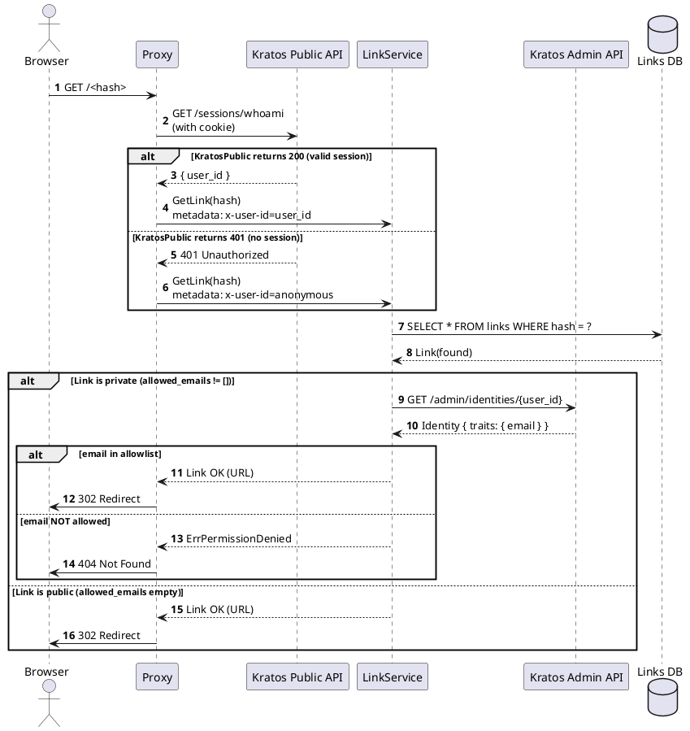

# 42. Link Privacy Control

Date: 2025-01-27

## Status

Accepted

## Context

Initially every link in the system was public: any user (even anonymous) could open URLs such as:

```text
https://shortlink.best/<hash>
```

Users asked for a way to restrict individual links so they can share them only with specific people.

### Requirements

- Keep supporting public links (backward compatible)
- Introduce private links controlled by an email allowlist
- Proxy must:
  - read `user_id` from the Kratos session
  - forward that `user_id` to LinkService
  - avoid doing authorization locally
- LinkService must:
  - enforce the privacy model internally
- Private links should behave like Google Docs private links:
  - only allowlisted users may open them
  - everyone else must get a 404 Not Found (hide resource existence)

## Decision

### 2.1. Privacy Model

Privacy is defined solely by the allowlist:

- **Public link** → `allowed_emails = []`
- **Private link** → `allowed_emails != []`

### 2.2. Domain Rules

The domain aggregate exposes the policy helpers:

```go
func (l *Link) IsPublic() bool {
    return len(l.AllowedEmails) == 0
}

func (l *Link) CanBeViewedByEmail(email string) bool {
    if l.IsPublic() {
        return true
    }

    normalized := normalizeEmail(email)
    for _, e := range l.AllowedEmails {
        if normalizeEmail(e) == normalized {
            return true
        }
    }

    return false
}
```

### 2.3. Proxy → LinkService Integration

**Proxy**:

- Reads Kratos session
- Extracts `user_id` from that session
- **If Kratos responds 401 (no valid session) Proxy sends `user_id = "anonymous"` to LinkService**
- Passes `user_id` via gRPC metadata `x-user-id: <kratos_user_id | anonymous>`

This removes ambiguity: LinkService can distinguish “Kratos error / user missing” from “user is anonymous”.

Proxy never makes privacy decisions.

### 2.4. LinkService GET (redirect)

`Get(hash, userID)`:

1. Fetch the link from DB
2. If `allowed_emails != []`:
   - the link is private
   - if `user_id == "anonymous"` → immediately return `ErrPermissionDenied` (skip Kratos)
   - otherwise call the **Kratos Admin API** (`GET /admin/identities/{user_id}`) to load the email
   - read `identity.traits.email`
   - check the allowlist
   - if the email is missing from allowlist → `ErrPermissionDenied`
3. If `allowed_emails == []`:
   - the link is public
   - return the link without calling either Kratos or SpiceDB

**Security Guarantee – Uniform Error Response**

**Every error while resolving the email results in `ErrPermissionDenied`,** including:

- Kratos network issues (timeout, connection refused, 500)
- JSON decoding failures
- Missing `traits.email` in the identity
- Email not on the allowlist
- `user_id == "anonymous"`

Therefore external observers cannot distinguish between:

- “email not allowlisted”
- “identity has no email”
- “Kratos is down”

All cases map to `ErrPermissionDenied` → Proxy returns HTTP 404 Not Found.

This mirrors the behavior of Google Docs, Dropbox, Notion, GitHub for private resources.

**Kratos Admin API Integration**

LinkService uses `github.com/ory/client-go` to talk to Kratos Admin API:

```go
identity, err := kratosAdminClient.IdentityApi.GetIdentity(ctx, userID).Execute()
if err != nil {
    // Any error -> ErrPermissionDenied (do not leak cause)
    return nil, domain.ErrPermissionDenied(err)
}

email, ok := identity.Traits["email"].(string)
if !ok || email == "" {
    // Missing email -> ErrPermissionDenied (do not leak cause)
    return nil, domain.ErrPermissionDenied(nil)
}

// Check allowlist
if !link.CanBeViewedByEmail(email) {
    // Not on allowlist -> ErrPermissionDenied (do not leak cause)
    return nil, domain.ErrPermissionDenied(nil)
}
```

### 2.5. SpiceDB Usage

SpiceDB is **not** used in GET (redirect use case).

It remains in use for:

- List (permission-filtered queries)
- Create
- Update
- Delete
- Team/org-level RBAC

### 2.6. Proxy 404 Behavior

Whenever LinkService returns `ErrPermissionDenied`, Proxy must respond with HTTP 404 Not Found.

This hides the existence of private links entirely.

## Sequence Diagram (Proxy → LinkService)



## Database Schema

Only one field is added:

```sql
allowed_emails TEXT[] NOT NULL DEFAULT '{}'
```

**Migration**:

- existing records get an empty array → become public

## API Changes

### gRPC Add/Update

Field:

```protobuf
repeated string allowed_emails = 8;
```

## Error Model

### Domain-level validation errors

- **`ErrInvalidEmail`**: Email does not match RFC 5322 format or is empty. Occurs when adding email to allowlist.
- **`ErrAllowlistTooLarge`**: Exceeded the limit of emails in allowlist (e.g., 100). Protects against abuse and limits data size.
- **`ErrDuplicateEmail`**: Email already exists in allowlist. Prevents duplicates after normalization (lowercase, trim).

### Access errors

- **`ErrPermissionDenied`**: User does not have access to private link (email not in allowlist or Kratos unavailable). Proxy converts it to HTTP 404 Not Found to hide link existence.

## Consequences

### Benefits

- Simple and clean privacy model
- Redirect logic is fast (no SpiceDB in GET)
- Minimal attack surface
- Strict hiding of private links (404)
- Proxy remains stateless regarding authorization
- LinkService is the single source of truth for access

### Drawbacks

- Requires loading user email via Kratos Admin API on every GET of a private link
- Identity cache needed for performance (cache email by user_id)
- Additional dependency on Kratos Admin API (must be available)

### Identity Cache Strategy

To optimize performance, LinkService caches user emails retrieved from Kratos Admin API:

- **Cache TTL**: 5–10 minutes
- **Invalidation**: not required, as email changes rarely
- **Cache key**: `user_id → email`
- **Scope**: only for private links (public links don't require email)

Cache reduces load on Kratos Admin API and speeds up access checks for private links.

### Risks & Mitigations

| Risk                                    | Mitigation                                |
| --------------------------------------- | ----------------------------------------- |
| Kratos Admin API unavailable → no email | cache + graceful degradation (return 404) |
| allowlist contains duplicates           | normalization + validation                |
| large number of emails                  | domain limit (e.g., 100)                  |
| High load on Kratos Admin API           | identity cache with TTL (e.g., 5 minutes) |

## Future Enhancements

- Token-based access for private links
- Link expiration / time-limited access
- Audit log for private link views
- Bulk import allowlist
