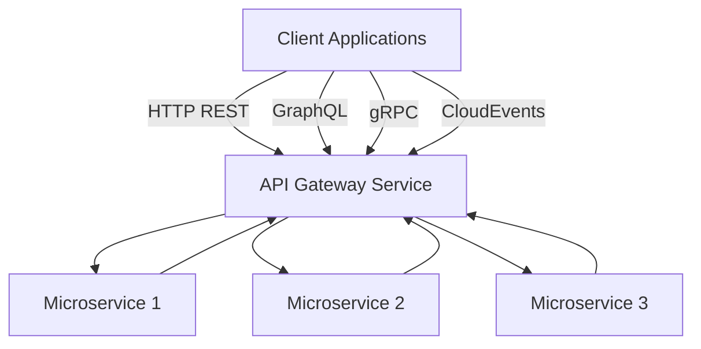

# 1. Init API Gateway Service

Date: 2023-06-17

## Status

Accepted

## Context

The system is growing and we have more and more microservices. Managing, routing, and controlling access 
to these microservices from various client applications is becoming increasingly complex. 
A need has arisen for a unified solution that can act as a single entry-point to these services, 
while providing common functionalities such as request routing, protocol translation, and authentication.

## Decision

We have decided to initiate the API Gateway Service. It will act as a single entry-point for client applications into 
our system of various microservices. By handling requests and responses, it will provide functionalities such as 
protocol translation, rate limiting, and authentication.

To maximize compatibility and usability across various types of client applications, the API Gateway Service 
will support different types of protocols:

- **HTTP REST API:** Built with 'chi', our REST API will offer clients a simple, stateless interface 
  for interacting with our resources using standard HTTP protocols.
- **GraphQL API:** This powerful query language offers an efficient and flexible approach to handle data, 
  allowing clients to request exactly the data they need.
- **gRPC-gateway:** A gRPC to JSON proxy generator, it enables HTTP/1 and HTTP/2 communication, making our services 
  more accessible to a wider variety of clients.
- **CloudEvents (Optional):** An open-standard specification, CloudEvents describes event data in a common way, 
  ensuring our API Gateway can interact with a wide range of other services and platforms.

This decision is visualized with the following architecture diagram:

## Consequences

By implementing an API Gateway Service, we can simplify the way client applications interact with our microservices. 
This enhances the reliability, scalability, and security of our system. It also reduces the complexity for 
the client applications as they need to interact with only a single gateway, rather than multiple microservices.

Furthermore, by supporting multiple protocols, we ensure flexibility and broad client compatibility. 
It is adaptable to a range of use cases, improving the usability of our system.

However, we also introduce a single point of failure in our system. This risk needs to be mitigated with suitable 
redundancy strategies and robust error handling. The API Gateway Service needs to be efficiently managed and maintained 
to keep up with the changes and evolution in our microservices ecosystem.
