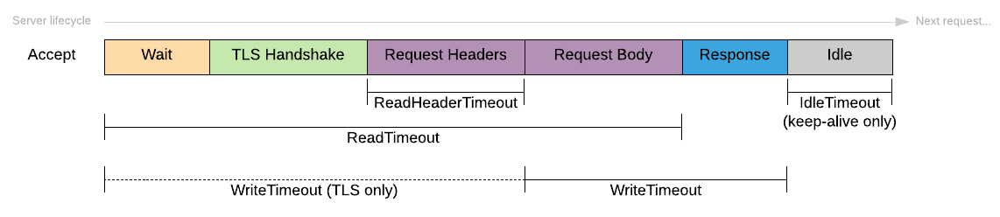

## http server

This package provides a default preconfigured http server.

### Handle Timeouts in Golang

### Docs

- [Make resilient Go net/http servers using timeouts, deadlines and context cancellation](https://ieftimov.com/posts/make-resilient-golang-net-http-servers-using-timeouts-deadlines-context-cancellation/)