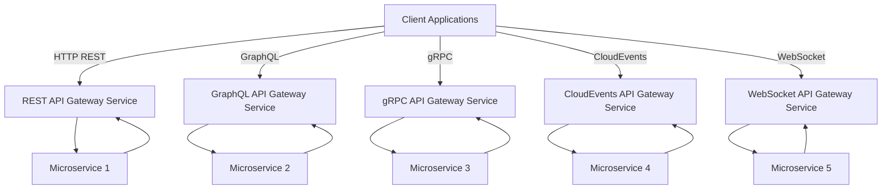

# 3. Adding WebSocket Protocol Support

Date: 2023-06-17

## Status

Accepted

## Context

Currently, our API Gateway services support HTTP REST, GraphQL, gRPC, and CloudEvents protocols. However, some client applications require real-time bi-directional communication between them and our microservices. The need for a more efficient protocol for real-time data transmission and updates has become apparent.

## Decision

To address this need, we have decided to add support for the WebSocket protocol in our system. WebSocket provides full-duplex communication channels over a single TCP connection. It is designed to be implemented in web browsers and web servers, but it can be used by any client or server application.

This new protocol will be managed by a separate WebSocket API Gateway Service, following the pattern established by the decision in ADR 0002.

The following diagram visualizes this decision:

## Consequences

The introduction of WebSocket support enhances our system's capabilities to provide real-time, bidirectional communication between client applications and our microservices. This will benefit applications requiring instant data updates or interactive features, such as collaborative apps, chats, and real-time analytics.

However, the addition of WebSocket support will increase the complexity of our system. The WebSocket protocol has different characteristics and error handling requirements compared to HTTP-based protocols. These differences will need to be managed and may require new types of testing and monitoring to ensure robust service delivery.

Moreover, implementing WebSocket may require changes in the client applications to handle the persistent connections and the full-duplex nature of the communication. To mitigate these issues, we must provide clear documentation and possibly SDKs to help developers integrate their applications with the new WebSocket API Gateway Service.

Finally, as this is a new protocol being added to our suite of services, we will need to train our team on WebSocket technology and best practices, possibly requiring further resources and time.
