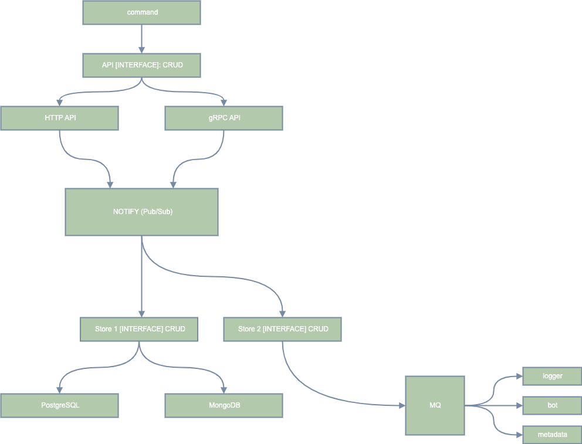

# API Services

Gateway for external clients

### HTTP API

+ Import [Postman link](./docs/postman/shortlink.postman_collection.json) for
  test HTTP API
+ Swagger [docs](https://shortlink-org.gitlab.io/shortlink)

###### Support HTTP REST API:

- HTTP (chi)
- gRPC-gateway
- GraphQL
- ***Optional***
    - [CloudEvents](https://cloudevents.io/)
