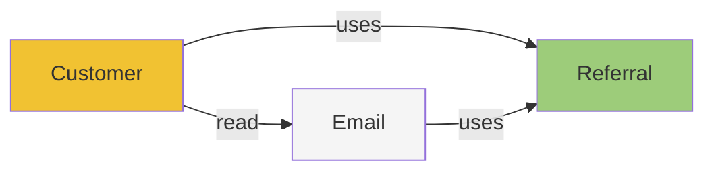

## Use Case: UC-2 Use referral

### Description

Use referral:

  * Use referral

### Actors

  * Customer
  * Referral

### Flow of events

```mermaid
graph LR
    style Customer fill:#f1c232
    style Referral fill:#9dcc7a
    style Email fill:#f5f5f5

    Customer -- uses --> Referral
    Customer -- read --> Email -- uses --> Referral
```
