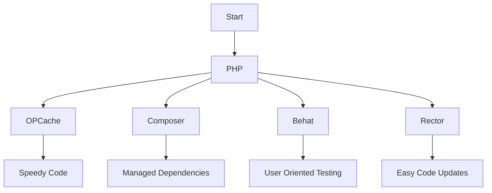

# 1. Init

Date: 2023-06-19

## Status

Accepted

## Context

We are embarking on the development of a new "Support Service" microservice. 
This service is intended to enhance our platform's user experience by providing robust customer support. 
Our goal is to ensure a quick resolution of issues and effective communication with our users. 
We need a technology stack and best practices that can handle high loads, ensure system stability, 
and can be easily maintained and updated.

## Decision

We've decided to use PHP for coding, with OPCache for speed and Composer for managing dependencies. For best practices, 
we'll use Behat for Behavior Driven Development (BDD), and Rector for easy PHP code updates.

## Consequences

Using PHP, OPCache, and Composer will make coding, code execution, and managing dependencies easier.
BDD with Behat will make testing user-oriented. Rector will simplify PHP code updates.

#### Mermaid Schema

This flow chart shows how our chosen tech stack and practices (from PHP to Rector) lead to the desired outcomes (from speedy code to easy code updates).
