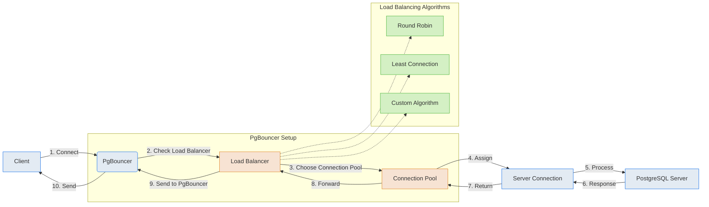

## PostgreSQL

### Load Balancer

#### [pgbouncer](https://www.pgbouncer.org/)

### Backup

- ❌ [wal-g](https://github.com/wal-g/wal-g/blob/master/docs/PostgreSQL.md) is a tool for PostgreSQL backup and restore.
  But bitnami deprecated docker image, so if we want to use it, we need to build it by ourselves.
