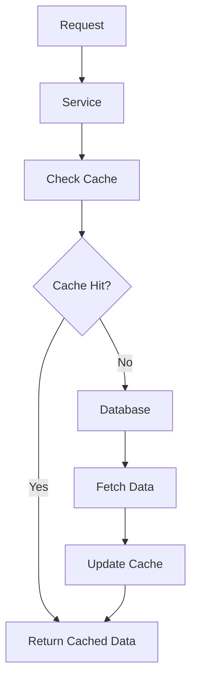

# 28. Cache System

Date: 2023-09-15

## Status

Accepted

## Context

Currently, our system utilizes Redis for general-purpose caching and Dragonfly for some applications. 
We are considering transitioning from Redis to KeyDB due to its similarities with Redis, 
which means we can switch databases without changing the driver for database interaction.

## Decision

Drivers:

  + **Performance**: The cache system should be able to handle high throughput and low latency.
  + **Scalability**: It should scale horizontally to accommodate increasing traffic.
  + **Community Support**: Availability of resources, documentation, and community support.
  + **Compatibility**: Compatibility with existing systems and ease of integration.
  + **Cost**: Both in terms of monetary cost and resource consumption.

Given the requirements and the pros and cons of each system:

  + If we prioritize sticking to a well-known, mature solution, continuing with Redis is the preferred choice.
  + If we are looking for performance improvements, especially for CPU-bound tasks, and are willing to invest in migration,
    KeyDB would be the best fit.

## Consequences

We continue to use Redis as our cache system.

### Additional Notes

- Redis documentation: https://redis.io/docs
- Dragonfly documentation: https://markevans.github.io/dragonfly
- KeyDB documentation: https://docs.keydb.dev
  - KeyDB Multi-Master and Active Replica: https://blog.palark.com/keydb-multi-master-and-active-replica/
