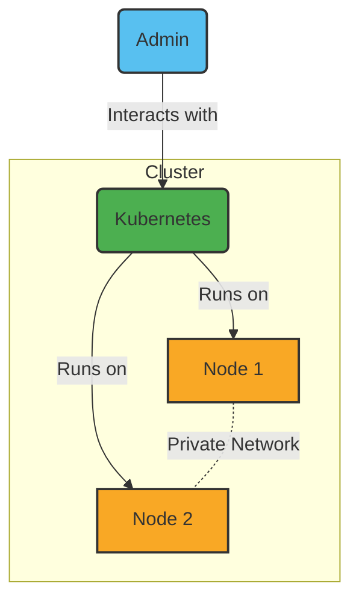

# 3. Maintaining Kubernetes

Date: 2023-12-20

## Status

Accepted

## Context

We need to decide how to deploy our services to Kubernetes and maintain our Kubernetes clusters. 
Previously, we used Kubespray for cluster maintenance but needed a more efficient solution. 
We also required a seamless method for deploying services to Kubernetes.

## Decision

### Kubernetes Cluster Maintenance

We have transitioned from Kubespray to Talos for maintaining our Kubernetes clusters. 
Talos is a modern OS designed specifically for Kubernetes, providing a minimal, immutable, and secure environment. 
We have also integrated the GitLab Agent in our Kubernetes clusters for improved CI pipeline connectivity.

### Deployment of Services

For the deployment of our services to Kubernetes, we will use the Helm package manager. 
This approach ensures efficient management of Kubernetes applications.

### Hardware Configuration

### CI/CD

We will use the GitLab CI/CD to deploy our services to Kubernetes.

### GitOps

We will use ArgoCD to manage our Kubernetes cluster.

- [Introduction to Continuous Delivery and GitOps using Argo CD](https://academy.akuity.io/courses/gitops-argocd-intro)

### Secrets

We use SOPS to manage our secrets.

## Consequences

- **Enhanced Cluster Security and Simplification**: Talos improves security and simplifies Kubernetes operations.
- **Efficient Updates and Rollbacks**: Talos offers reliable, minimal-downtime update and rollback processes.
- **Improved CI Integration**: GitLab Agent enables automated, secure CI connections.
- **GitOps Efficiency**: ArgoCD enhances cluster management via GitOps.
- **Secure Secret Management**: SOPS ensures secure handling of secrets.

## References

1. **Talos Systems**: For detailed information about Talos, visit their official website: [Talos Systems](https://www.talos.dev/).
2. **GitLab Kubernetes Agent**: To learn more about the GitLab Agent for Kubernetes, refer to the official documentation at [GitLab Kubernetes Agent](https://docs.gitlab.com/ee/user/clusters/agent/).
