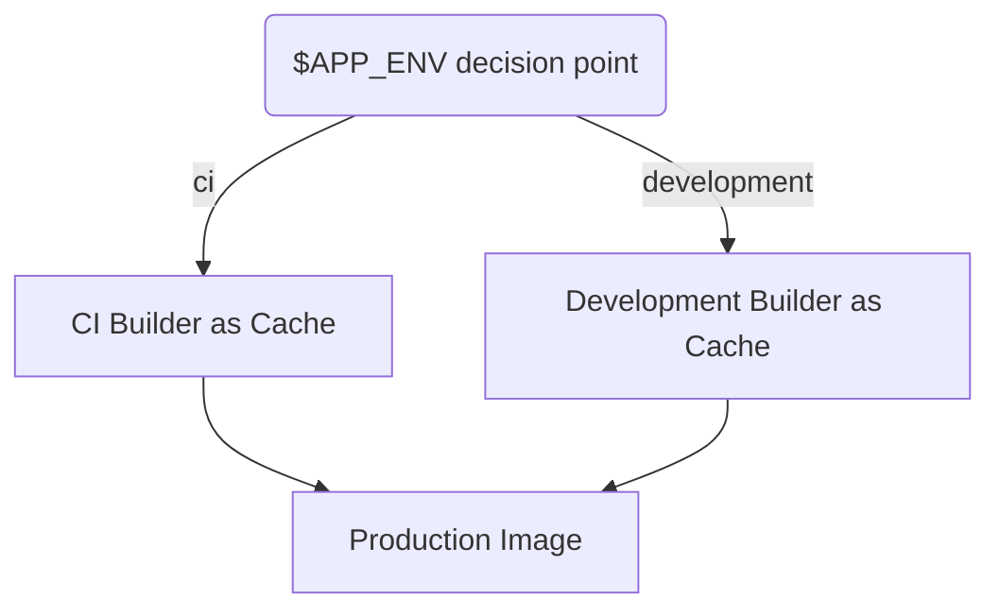

# 10. Docker tips [Cookbook]

Date: 2024-02-21

## Status

Accepted

## Context

We have a GitLab CI/CD pipeline that builds and tests our application in a Docker container.
We want to speed up the build process by caching the Docker layers.

## Cookbook

### Recipe 1: Using external cache in a multi-platform Dockerfile

This recipe optimizes Docker builds for multi-platform environments, ensuring efficient use of caching and 
external dependencies.



```yaml
# Base stage: Install dependencies only when needed
FROM --platform=$BUILDPLATFORM node:21.6-alpine AS development-builder

# Development build stage: Copy over only necessary files for production
FROM --platform=$BUILDPLATFORM development-builder AS cache
COPY --from=development-builder /app/packages/next/out /app/out

# Cache stage: Prepare artifacts for production without additional dependencies.
FROM --platform=$BUILDPLATFORM alpine:3.19 AS ci-builder
FROM --platform=$BUILDPLATFORM ${APP_ENV}-builder AS cache

COPY ./boundaries/ui-monorepo/packages/next/out /app/out

# Production image: use cache from development or CI layers
FROM ghcr.io/nginxinc/nginx-unprivileged:1.25-alpine
COPY --from=cache /app/out ./next
```

### Recipe 2: Lazy pulling stargz/eStargz base images

- [Docs](https://github.com/moby/buildkit/blob/master/docs/stargz-estargz.md)
