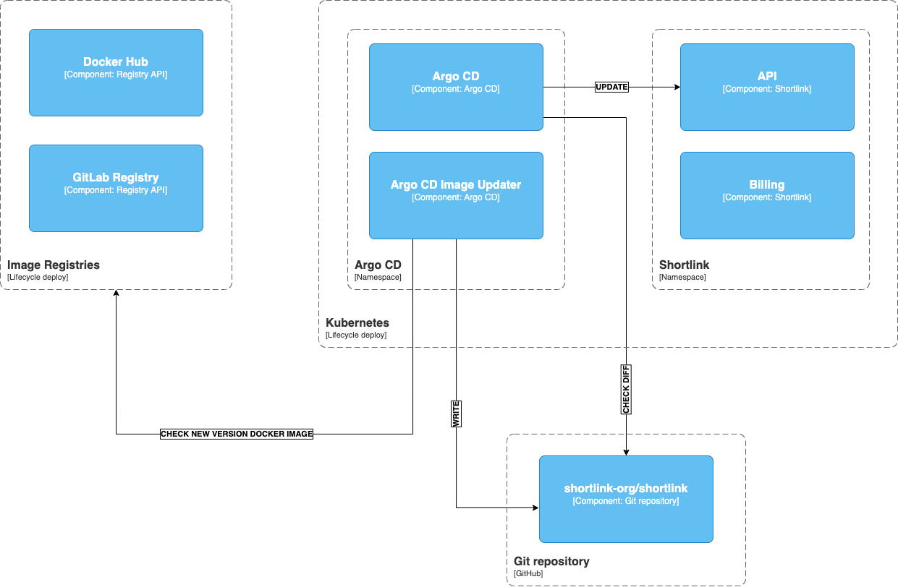

# 16. Lifecycle deploy

Date: 2023-02-10

## Status

Accepted

## Context

We need to decide how we will update images in ArgoCD.

## Decision

### ArgoCD ApplicationSet

We use Helm chart [argocd-shortlink](https://github.com/shortlink-org/shortlink/tree/main/ops/Helm/addons/argocd-shortlink) for deploy ArgoCD ApplicationSet.

We use argocd wave for priority deploy.

**steps:**
1. [0] deploy infrastructure (Istio, cert-manager, etc...)
2. [1] deploy observability (Prometheus, Grafana, etc...)
3. [2] deploy shortlink (shortlink-link, shortlink-landing, etc...)
3. [2] deploy knative (knative-serving, knative-eventing, etc...)

### ArgoCD Image Updater

We use [argocd-image-updater](https://github.com/argoproj-labs/argocd-image-updater#argo-cd-image-updater) for update images in ArgoCD.

## Consequences

+ We can update images in ArgoCD use [argocd-image-updater](https://github.com/argoproj-labs/argocd-image-updater#argo-cd-image-updater).
