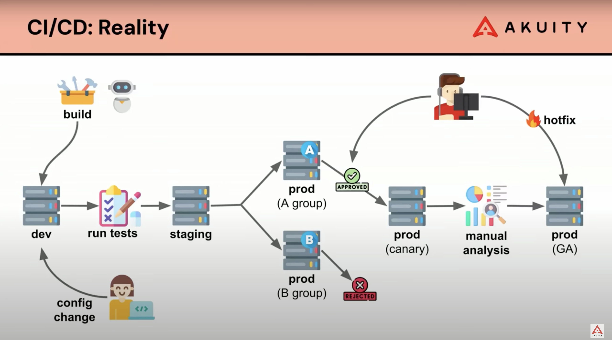

# 28. Application lifecycle orchestration

Date: 2023-10-10

## Status

Accepted

## Context

The necessity for a next-gen continuous delivery and application lifecycle orchestration platform tailored for Kubernetes was recognized.

The platform should be able to:

- Automate the progressive rollout of changes across application lifecycle stages
- Leverage GitOps principles
- Integrate with technologies like Argo CD, Flux, and Tekton

## Decision

Adopt Kargo for streamlining and automating the progressive rollout of changes across application lifecycle stages, leveraging GitOps principles and integrating with technologies like Argo CD, Flux, and Tekton.

## Consequences

Enhanced automation, streamlined application delivery, and the mitigation of confusion between deployment stages. Potential breaking changes during active Kargo development are to be anticipated.
