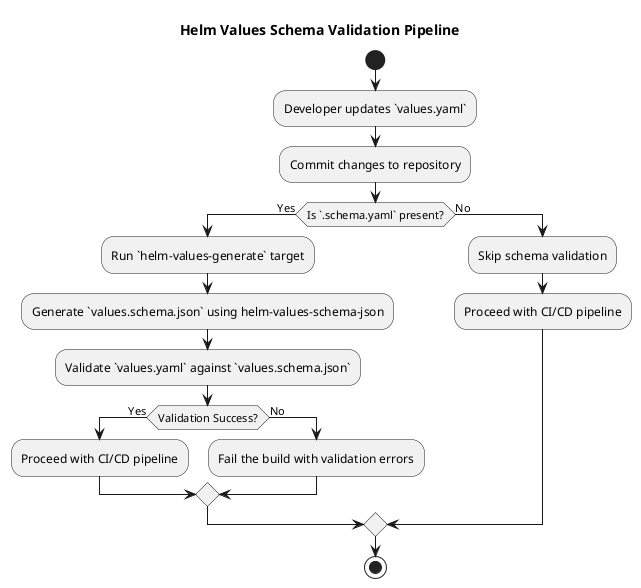

# 33. Helm: Use `values.schema.json`

Date: 2024-10-21

## Status

Accepted

## Context

As our infrastructure grows, maintaining consistency and ensuring the correctness of Helm chart configurations has become increasingly challenging. We have multiple Helm charts across different services, and without proper validation, misconfigurations in `values.yaml` can lead to deployment failures or unexpected behavior in our applications.

Currently, there's no standardized way in our workflow to enforce schema validation on the values provided to Helm charts. This lack of validation increases the risk of runtime errors and complicates the debugging process when deployments fail due to incorrect configurations.

We need a solution that allows us to define, validate, and enforce the structure and types of the configurations expected by our Helm charts.

## Decision

We have decided to utilize `values.schema.json` files in our Helm charts to define the expected configuration schema and enforce validation of `values.yaml` files. This will be implemented by:

- **Using the [helm-values-schema-json](https://github.com/losisin/helm-values-schema-json) plugin**:
  - This tool allows us to generate `values.schema.json` from `.schema.yaml` files.
  - It integrates seamlessly with Helm and provides a standardized approach to schema validation.

- **Updating our Helm charts to include `.schema.yaml` files**:
  - These YAML files will define the configuration schema using JSON Schema specifications.
  - Having schema definitions in YAML makes them more readable and maintainable for our team.

- **Modifying our build process and Makefiles**:
  - Adding a `helm-values-generate` target to automate the generation of `values.schema.json` for all Helm charts.
  - Ensuring that the schema generation is part of our CI/CD pipeline to catch errors early in the development process.

- **Validating `values.yaml` against the schema**:
  - Helm will automatically validate `values.yaml` files against `values.schema.json` during chart installation and upgrades.
  - This ensures that any deviations from the expected configuration are caught before deployment.

### Pipeline Schema

Below is a PlantUML diagram illustrating the schema validation pipeline:

## Consequences

**Benefits:**

- **Enhanced Configuration Validation**: Implementing schema validation significantly reduces the likelihood of deployment failures caused by incorrect or incomplete `values.yaml` configurations.
- **Consistency Across Charts**: Establishing a standardized schema approach ensures uniformity in how configurations are defined and validated across all Helm charts.
- **Proactive Error Detection**: Integrating schema validation into the CI/CD pipeline allows for the early identification of configuration issues, thereby minimizing debugging efforts and deployment delays.
- **Comprehensive Documentation**: The `values.schema.json` files act as living documentation for expected configurations, facilitating easier onboarding and collaboration among team members.
- **Automated Schema Management**: Automating the generation and maintenance of schema files ensures that they remain up-to-date with the latest configuration changes, reducing manual oversight.

**Drawbacks:**

- **Initial Setup Effort**: Defining and integrating schemas for existing Helm charts requires an upfront investment of time and resources.
- **Learning Requirement**: Team members need to acquire knowledge of JSON Schema specifications and become proficient with the `helm-values-schema-json` plugin to effectively manage schemas.
- **Ongoing Maintenance**: As Helm chart configurations evolve, corresponding schema files must be updated to reflect these changes, necessitating continuous attention to maintain alignment.

## References

- [helm-values-schema-json Plugin](https://github.com/losisin/helm-values-schema-json)
- [Validate Helm Chart Values with JSON Schemas](https://www.arthurkoziel.com/validate-helm-chart-values-with-json-schemas/)

